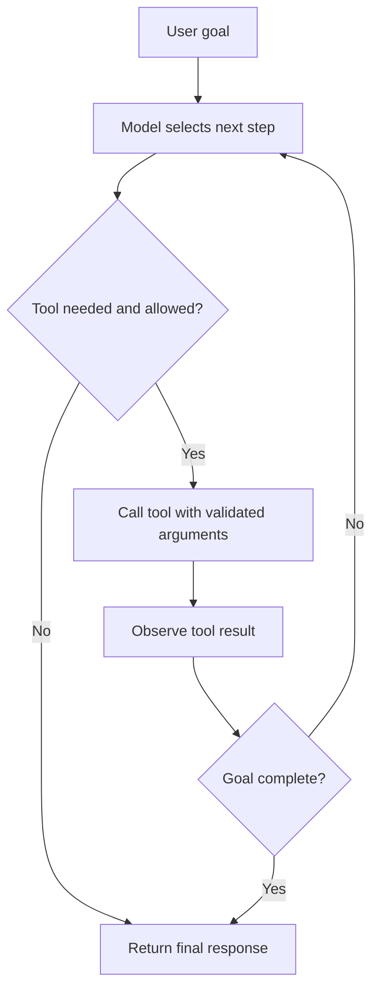

 Tool Use and Agents

Tags: #ai #agents
Difficulty: Hard
Status: Learning

## Definition

Agents use reasoning and tools to break goals into actions, call APIs, inspect results, and adapt their next step.

## Why it matters / when to use

This is the foundation of agentic AI systems: a model may plan, act, and reflect across multiple steps to complete a task.

## How it works

A planner or orchestrator chooses tools, executes them, interprets outputs, and decides whether more actions are needed.



## Code example

```ts
const tools = [
  { name: "search_docs", description: "Search documentation" },
  { name: "run_command", description: "Execute a shell command" }
];

console.log(tools.map((tool) => tool.name));
```

## Time and space complexity

The complexity comes from orchestration depth and tool-call latency, not traditional algorithmic runtime.

## Common mistakes and pitfalls

- Letting agents act without clear tool boundaries
- Forgetting failure handling and retries
- Over-trusting the model with high-impact actions

## Interview questions

### Q: What is a key risk of multi-step agents?
Model answer: The system can drift, take the wrong tool path, or make a high-impact decision based on incomplete reasoning; guardrails and evaluation are essential.

## Related topics

- [LLM basics](llm-basics.md)
- [MCP overview](mcp.md)
- [Evaluation and testing](evals.md)
