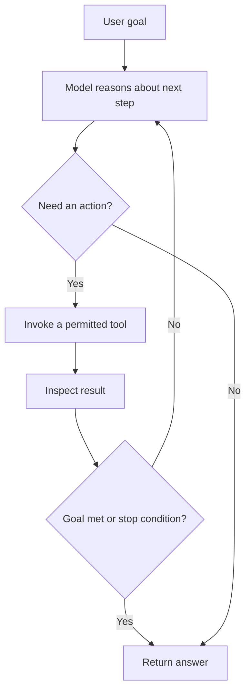

# What agents are

## Definition

An agent is a system that can reason, choose actions, invoke tools, and iterate until the task is complete or a stop condition is reached.

## What makes it different from a simple prompt?

- It can call external tools
- It can inspect intermediate results
- It can plan a sequence of steps instead of answering in one shot
- It often works with memory and guardrails

## Example workflow

## Interview guidance

- Agents are not magic; they need explicit boundaries and good evaluation.
- Tool use is usually where reliability comes from.
- A good agent design clearly separates planning, execution, and verification.

## Related notes

- [Tool calling](tool-calling.md)
- [RAG](rag.md)
- [Memory and guardrails](memory-and-guardrails.md)
