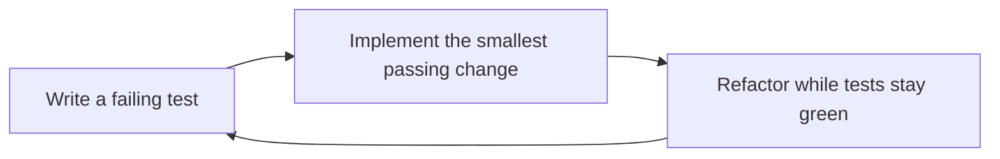

 TDD Workflow

Tags: #testing #tdd
Difficulty: Medium
Status: Learning

## Definition

Test-Driven Development writes a failing test first, then implements the smallest required code to pass it, and refactors.

## Why it matters / when to use

It helps clarify requirements early and keeps code focused on verifiable behavior.

## How it works

Write a failing test, implement the behavior, run the test, refactor, and repeat.



## Code example

```ts
function square(n: number) {
  return n * n;
}

console.log(square(4)); // 16
```

## Time and space complexity

TDD is about scaffolding and validation quality, not algorithmic complexity.

## Common mistakes and pitfalls

- Writing implementation-focused tests
- Skipping the refactor step
- Treating TDD as a strict religion instead of a disciplined workflow

## Interview questions

### Q: Does TDD guarantee quality?
Model answer: No, but it helps shape the design and exposes requirements earlier. It is one part of a broader QA and engineering strategy.

## Related topics

- [Testing pyramid](test-pyramid.md)
- [Unit testing](unit-testing.md)
- [Integration testing](integration-testing.md)
