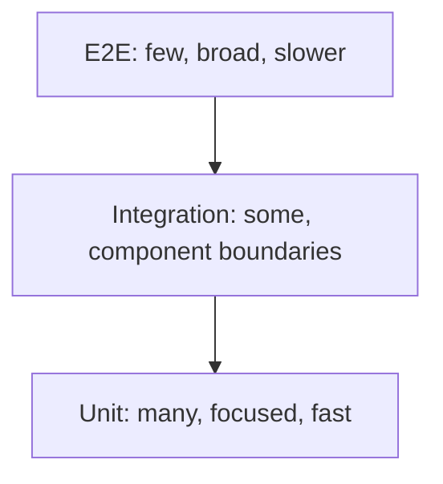

 Testing Pyramid

Tags: #testing #quality
Difficulty: Medium
Status: Learning

## Definition

The testing pyramid suggests a healthy distribution of test types: many unit tests, fewer integration tests, and the fewest end-to-end tests.

## Why it matters / when to use

It helps keep a test suite fast and valuable while still validating user-facing behavior.

## How it works

Unit tests cover logic cheaply, integration tests validate component interactions, and E2E tests confirm real workflows and user experience.

The pyramid narrows upward: tests generally become broader and more expensive as their scope increases.



## Code example

```ts
import { describe, it, expect } from "vitest";

describe("sum", () => {
  it("adds two numbers", () => {
    expect(1 + 2).toBe(3);
  });
});
```

## Time and space complexity

Test suites are primarily about speed and confidence rather than algorithmic complexity.

## Common mistakes and pitfalls

- Testing implementation details instead of behavior
- Overrelying on E2E tests for every bug
- Not paying attention to flaky tests

## Interview questions

### Q: Why not write only end-to-end tests?
Model answer: They are slower, more expensive, and harder to localize; a balanced strategy is faster to iterate on and more reliable for debugging.

## Related topics

- [Unit testing](unit-testing.md)
- [Integration testing](integration-testing.md)
- [E2E testing](e2e.md)
