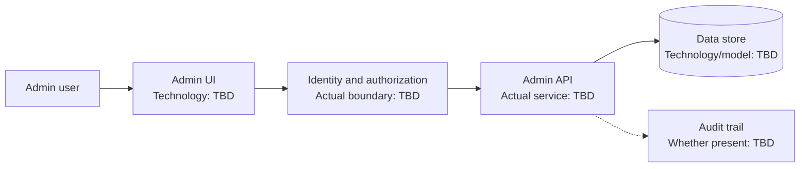

# Admin Panel Architecture - Interview Deep Dive

> **Evidence boundary:** The supplied resume profile names “admin panel architecture” but gives no problem, technology, users, architecture, ownership, or outcome. This is a preparation scaffold, not a description of the delivered system. Keep unknowns as `> TODO: verify`.

## Definition

An admin-panel architecture is the set of UI, API, identity/authorization, and data boundaries used by an administrative product. The actual panel's scope and design are **> TODO: verify**.

## STAR story (behavioral-story template)

### Situation

> TODO: verify — business context, users, existing workflow, and problem being addressed.

### Task

> TODO: verify — your role, deliverables, constraints, and success criteria.

### Action

> TODO: verify — actual discovery, design, implementation, review, testing, and rollout work you personally completed.

### Result

> TODO: verify — measured or otherwise evidenced outcome and its source.

## Requirements (system-design-case template)

### Functional requirements

- > TODO: verify — actual user roles, workflows, entities, and administrative actions.

### Non-functional requirements

- > TODO: verify — security, auditability, accessibility, performance, availability, and scale requirements that applied.

## How it works

> TODO: verify — describe the actual request flow, identity checks, authorization boundary, API calls, data access, audit logging, and error handling. Do not assume a specific frontend framework or service decomposition.

## Estimation

- Admin users / concurrency / request volume: > TODO: verify
- Data volume and retention needs: > TODO: verify
- Assumptions and evidence source: > TODO: verify

## API design

- Actual endpoints, contracts, pagination, filtering, or mutations: > TODO: verify
- Authentication and authorization behavior: > TODO: verify

## Data model

- Actual entities, ownership, constraints, and indexes: > TODO: verify
- Audit-history or retention requirements: > TODO: verify

## High-level architecture

The diagram is a generic discussion aid only. Replace each TBD box with verified components; do not claim this was the project's architecture until confirmed.



## Working code example

This runnable TypeScript helper demonstrates allow-list filtering by role. It is an interview-preparation example, **not a claim about the project's implementation**. Server-side authorization is still required; hiding a UI link is not a security boundary.

```ts
type Role = "viewer" | "editor" | "admin";

type Action = {
  id: string;
  label: string;
  allowedRoles: readonly Role[];
};

function visibleActions(actions: readonly Action[], role: Role): Action[] {
  return actions.filter((action) => action.allowedRoles.includes(role));
}

const actions: Action[] = [
  { id: "view", label: "View records", allowedRoles: ["viewer", "editor", "admin"] },
  { id: "edit", label: "Edit records", allowedRoles: ["editor", "admin"] },
  { id: "manage-users", label: "Manage users", allowedRoles: ["admin"] },
];

console.log(visibleActions(actions, "editor").map((action) => action.id));
```

Expected output: `['view', 'edit']`.

Complexity: for $n$ actions and role-list lengths totaling $r$, time is $O(n + r)$ in the worst case; output space is $O(n)$. This UI filter does not replace authorization checks at the API/data boundary.

## Deep dives

### Storage and security

- Actual identity, role/permission model, and enforcement point: > TODO: verify
- Sensitive data, auditability, and retention controls: > TODO: verify

### Caching and async work

- What data was cached, where, and invalidation approach: > TODO: verify (or state not applicable)
- Background work, retries, and idempotency: > TODO: verify (or state not applicable)

## Bottlenecks and trade-offs

- Bottleneck or reliability issue: > TODO: verify
- Evidence and mitigation: > TODO: verify
- Trade-offs made and why: > TODO: verify

### Alternatives considered and rejected

| Alternative | Why considered | Why rejected / evidence |
| --- | --- | --- |
| > TODO: verify | > TODO: verify | > TODO: verify |
| > TODO: verify | > TODO: verify | > TODO: verify |

Complexity/trade-offs: there is no single Big-O value for an admin product architecture. Explain verified latency, authorization, audit, operability, maintainability, and delivery trade-offs. Project-specific choices: > TODO: verify.

## Metrics and evidence

The profile lists `60%`, `45%`, `85%`, `4x`, `300+ tests`, and `120+ users` without assigning metrics to projects.

- Metric associated with this project: > TODO: verify
- **How I measured this: (fill in)**
- Baseline, definition/formula, time window, source, attribution, and limitations: > TODO: verify

## Common mistakes

- Treating client-side role filtering as authorization.
- Presenting the generic diagram or code sample as the actual project architecture.
- Omitting audit/security requirements for privileged actions when they applied.
- Quoting a metric without a baseline, measurement method, and evidence source.
- Claiming personal ownership for team decisions without clarifying your contribution.

## Interview questions and model-answer scaffolds

Replace brackets only with project facts you can support.

1. **What problem did the admin panel solve?** — “It supported **[verified workflow/users]**; the original issue was **[evidence-backed problem]**.”
2. **Who were its users, and what permissions did they need?** — “The verified roles were **[roles]**; access was enforced at **[actual boundary]**.”
3. **What did you personally design or implement?** — “I owned **[specific deliverable]** and coordinated with **[verified roles]**.”
4. **How did the UI communicate with backend services?** — “The actual flow was **[verified UI/API/service flow]**, with **[verified error/loading behavior]**.”
5. **How were privileged actions protected?** — “The system checked **[actual identity/authorization rule]** at **[verified enforcement point]**.”
6. **How did you handle audit history or sensitive data?** — “The requirement was **[verified need]**; the implemented control was **[actual control]**.”
7. **What data model or API decision mattered most?** — “We chose **[actual choice]** because **[verified constraint/trade-off]**.”
8. **Which alternative did you reject?** — “We considered **[real alternative]** and rejected it due to **[documented evidence/trade-off]**.”
9. **How did you validate the design and its outcome?** — “We used **[actual tests/signals]**; the evidence was **[source/result]**.”
10. **What metric can you defend?** — “The verified metric is **[metric]**. **How I measured this: (fill in)**; baseline and source: **[fill in]**.”

## Follow-up questions

Prepare project-specific answers for scaling, access-control edge cases, audit retention, failure handling, and future changes. Unknown details remain `> TODO: verify`.

## Related notes

- [Resume deep-dive index](README.md)
- [System design fundamentals](../06-system-design/system-design-fundamentals.md)
- [Behavioral STAR method](../11-behavioral-hr/star-method.md)
- [System design case template](../templates/system-design-case.md)
