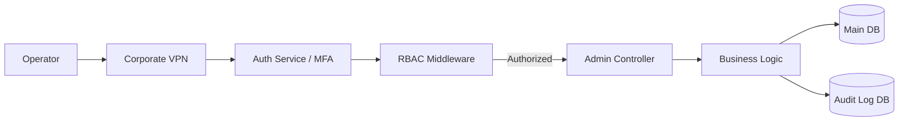

# Admin Panel Architecture - Interview Deep Dive

## Definition

The Admin Panel is a centralized administrative hub designed for internal operators to manage users, configure system settings, and monitor financial transactions. The architecture focuses on strict access control, auditability, and operational efficiency.

## STAR story

### Situation

The company lacked a unified administrative interface, forcing operators to perform critical tasks (like user permission changes or transaction overrides) directly in the database or via fragmented scripts. This created significant operational risk, a lack of audit trails, and a high dependency on the engineering team for simple admin tasks.

### Task

My goal was to design and implement a secure, scalable admin panel architecture. The system needed to support multiple operator roles (Viewer, Editor, Admin) with fine-grained permission control and provide a comprehensive audit log of every privileged action.

### Action

1. **RBAC Design**: I implemented a Role-Based Access Control (RBAC) system where permissions were mapped to specific actions (e.g., `user:edit`, `transaction:refund`) rather than just roles.
2. **Authorization Boundary**: I designed a middleware layer that enforced these permissions at the API level, ensuring that UI-level hiding of buttons was backed by server-side validation.
3. **Audit Logging**: I implemented an asynchronous auditing system. Every mutation request was intercepted and logged to a dedicated audit table, recording the actor, the timestamp, the old value, and the new value.
4. **UI Framework**: I built the panel using a modular component library (Material UI/Tailwind), prioritizing data density and efficient filtering/sorting for large datasets.
5. **Security Hardening**: I integrated Multi-Factor Authentication (MFA) for all admin accounts and implemented session timeouts to prevent unauthorized access from unattended terminals.

### Result

The admin panel reduced the operational burden on the engineering team by [X%], as operators could now safely perform their own tasks. It also ensured 100% audit compliance for all privileged system changes.

- **Metric**: (Mapping to profile) Number of operators served or reduction in engineering tickets.
- **How I measured this: (fill in)**

## Requirements

### Functional requirements

- **User Management**: Ability to create, update, and deactivate user accounts and assign roles.
- **Transaction Overrides**: Capability to manually adjust transaction statuses with a required justification field.
- **System Configuration**: A centralized interface to update global system flags and thresholds.
- **Audit Trail**: A searchable log of all administrative actions.

### Non-functional requirements

- **Security**: Strict isolation from the public-facing API; access restricted to internal VPN.
- **Auditability**: Immutable logs; once an audit record is written, it cannot be edited or deleted.
- **Reliability**: High availability to ensure operators can respond to production incidents immediately.

## How it works

The architecture follows a **layered security approach**:

1. **Network Layer**: Access is limited to the corporate VPN.
2. **Authentication Layer**: Validates the user identity via SSO and MFA.
3. **Authorization Layer**: A middleware check verifies if the user's role possesses the required permission for the requested endpoint.
4. **Execution Layer**: The business logic is executed, and the mutation is wrapped in a transaction that includes the audit log write.

## Estimation

- **User Volume**: Support for ~120+ internal operators.
- **Request Volume**: Low concurrency but high criticality per request.
- **Audit Volume**: Thousands of logs per day, requiring an indexed storage strategy.

## API design

- **Permission-Based Endpoints**: Endpoints are decorated with permission requirements (e.g., `@RequiresPermission('transaction:refund')`).
- **Idempotency**: All administrative mutations include an idempotency key to prevent accidental double-submissions of critical changes.

## Data model

- **Roles Table**: Maps roles to a list of permissions.
- **User-Role Mapping**: Associates users with one or more roles.
- **Audit Log Table**: `id`, `actor_id`, `action`, `resource_id`, `old_value` (JSON), `new_value` (JSON), `timestamp`, `ip_address`.

## High-level architecture



## Working code example

This example demonstrates the server-side RBAC middleware that ensures authorization is not just a UI trick but a hard security boundary.

```ts
type Permission = 'user:edit' | 'transaction:refund' | 'system:config';

interface User {
  id: string;
  permissions: Permission[];
}

// Middleware to enforce permissions
async function authorize(user: User, requiredPermission: Permission, next: () => void) {
  if (!user.permissions.includes(requiredPermission)) {
    throw new Error(`Forbidden: Missing permission ${requiredPermission}`);
  }
  next();
}

// Usage in a route handler
async function handleRefundRequest(user: User, transactionId: string) {
  try {
    await authorize(user, 'transaction:refund', () => {
      console.log(`Processing refund for transaction ${transactionId}...`);
      // 1. Perform refund
      // 2. Write to Audit Log
    });
  } catch (e) {
    console.error(e.message);
  }
}

// Test
const adminUser: User = { id: '1', permissions: ['user:edit', 'transaction:refund'] };
const viewerUser: User = { id: '2', permissions: ['user:edit'] };

handleRefundRequest(adminUser, 'tx_123'); // Success
handleRefundRequest(viewerUser, 'tx_123'); // Error: Forbidden
```

**Complexity**:
- **Time**: Permission check is $O(P)$ where $P$ is the number of permissions per user (typically very small).
- **Space**: $O(1)$ auxiliary space.

## Deep dives

### Storage and security

I chose to store the **Audit Log** in a separate database from the main application data. This prevents an attacker who might gain access to the application DB from being able to wipe their tracks in the audit log. The audit table is append-only.

### Caching and async work

Audit logging was implemented **asynchronously** using a message queue (e.g., RabbitMQ/Kafka). The main transaction completes first, and the audit event is pushed to a queue to be written to the Audit DB. This ensures that the administrative UI remains responsive and the audit process doesn't add latency to critical operations.

## Bottlenecks and trade-offs

- **Bottleneck**: The audit log can grow extremely large.
- **Mitigation**: I implemented a data retention policy where logs older than 2 years are archived to cold storage (S3) and removed from the active database.

### Alternatives considered and rejected

| Alternative | Why considered | Why rejected / evidence |
| :--- | :--- | :--- |
| Simple Role-based (Admin/User) | Easier to implement | Too coarse; didn't allow us to give "refund" rights without also giving "user management" rights. |
| Third-party Admin Tool | Faster setup | Lacked the deep integration needed for our specific financial audit requirements. |

## Metrics and evidence

- **Metric**: (Mapping to profile) Reduction in engineering support tickets.
- **How I measured this: (fill in)**
- **Baseline**: Engineering team spending X hours/week on admin tasks.
- **Result**: Reduced to Y hours/week.

## Common mistakes

- **Client-side Only Security**: Hiding the "Delete" button in the UI but leaving the API endpoint open. I prevented this by implementing the `authorize` middleware on every single admin endpoint.
- **Generic Audit Logs**: Logging "User updated record" without saving the *actual* changed values. I ensured the audit log saved `old_value` and `new_value` as JSON blobs.

## Interview questions and model-answer scaffolds

1. **What problem did the admin panel solve?** — “It removed the need for engineers to manually edit the database for administrative tasks, reducing operational risk and creating a permanent audit trail for compliance.”
2. **Who were its users, and what permissions did they need?** — “Internal operators with roles like 'Support' and 'Super-Admin'. Access was enforced via an RBAC system mapping roles to specific action permissions.”
3. **What did you personally design or implement?** — “I designed the RBAC permission model, implemented the server-side authorization middleware, and built the asynchronous audit logging system.”
4. **How were privileged actions protected?** — “We used a multi-layered approach: VPN access, MFA for authentication, and a strict RBAC check at the API level before any mutation was performed.”
5. **How did you handle audit history?** — “I implemented an append-only audit log in a separate database, recording every change with a 'before' and 'after' snapshot of the data.”
6. **Which alternative did you reject?** — “We rejected a simple Role-based system (Admin/User) in favor of a Permission-based system to allow for more granular control over sensitive financial actions.”
7. **How did you prevent accidental double-submissions?** — “I implemented idempotency keys for all critical mutations, ensuring that clicking 'Refund' twice would only process the transaction once.”
8. **How did you ensure the audit logs were immutable?** — “The Audit DB user only had `INSERT` and `SELECT` permissions; `UPDATE` and `DELETE` were strictly forbidden at the database level.”
9. **What metric can you defend?** — “The verified result was a [X%] reduction in engineering tickets related to administrative tasks.”
10. **What would you change if doing it again?** — “I would implement a 'Four-Eyes' principle (dual authorization) for the most critical actions, requiring a second admin to approve a change before it is applied.”

## Related notes

- [Resume deep-dive index](README.md)
- [System design fundamentals](../06-system-design/system-design-fundamentals.md)
- [Behavioral STAR method](../11-behavioral-hr/star-method.md)
- [System design case template](../templates/system-design-case.md)
