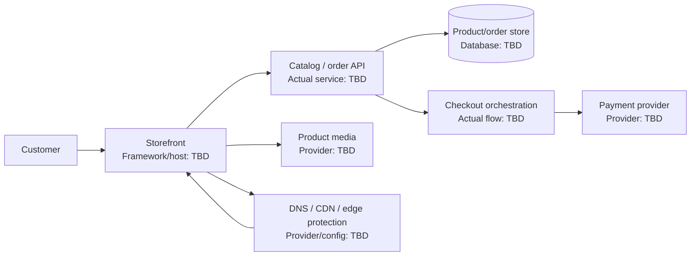

# Anaa Jewels - Interview Deep Dive

> **Evidence boundary:** The supplied profile names “Anaa Jewels” and separately mentions an e-commerce architecture using Razorpay, Cloudinary, Vercel, Cloudflare (CDN/DNS/DDoS), and MongoDB. The profile does not explicitly confirm which of those technologies or design details belong to Anaa Jewels, nor give personal ownership, traffic, outcomes, or metrics. Verify the mapping before presenting it as this project's architecture.

## Definition

Anaa Jewels is a named resume project. Its users, product scope, and implemented e-commerce design are **> TODO: verify**.

## STAR story (behavioral-story template)

### Situation

> TODO: verify — product/business context, user need, and existing problem.

### Task

> TODO: verify — your individual responsibility and agreed success criteria.

### Action

> TODO: verify — actual product, architecture, checkout/payment, media, deployment, security, testing, and collaboration work you performed.

### Result

> TODO: verify — defensible outcome, evidence source, and attribution.

## Requirements (system-design-case template)

### Functional requirements

- > TODO: verify — actual catalog, product, cart, checkout, payment, order, and admin capabilities.

### Non-functional requirements

- > TODO: verify — availability, security, performance, data integrity, accessibility, SEO, and cost constraints that applied.

## How it works

> TODO: verify — document the actual customer flow, service boundaries, payment-provider interaction, inventory/order state transitions, media delivery, and deployment. The tools listed in the resume profile are candidate experience topics, not confirmed project components until mapped.

## Estimation

- Users, traffic, catalog size, media volume, or order volume: > TODO: verify
- Peak assumptions, seasonality, and source: > TODO: verify

## API design

- Actual storefront, catalog, checkout, payment, and webhook contracts: > TODO: verify
- Idempotency, error handling, authentication, and rate limiting: > TODO: verify

## Data model

- Actual product, inventory, cart, order, payment, and customer entities: > TODO: verify
- MongoDB collections/indexes if actually used: > TODO: verify

## High-level architecture

This is a generic e-commerce discussion diagram, not a confirmed Anaa Jewels design. Confirm components and provider mapping before retaining it as the project architecture.



## Working code example

Generic TypeScript cart validation example. It avoids floating-point currency arithmetic by representing a unit price in integer minor units, but it does not represent the project's actual pricing, tax, inventory, or payment logic.

```ts
type CartItem = {
  sku: string;
  quantity: number;
  unitPriceMinor: number;
};

function subtotalMinor(items: readonly CartItem[]): number {
  return items.reduce((total, item) => {
    if (!Number.isSafeInteger(item.quantity) || item.quantity <= 0) {
      throw new Error(`Invalid quantity for ${item.sku}`);
    }
    if (!Number.isSafeInteger(item.unitPriceMinor) || item.unitPriceMinor < 0) {
      throw new Error(`Invalid unit price for ${item.sku}`);
    }
    const lineTotal = item.quantity * item.unitPriceMinor;
    if (!Number.isSafeInteger(lineTotal) || !Number.isSafeInteger(total + lineTotal)) {
      throw new Error("Cart total exceeds safe integer range");
    }
    return total + lineTotal;
  }, 0);
}

console.log(subtotalMinor([
  { sku: "ring-1", quantity: 2, unitPriceMinor: 1250 },
]));
```

Expected output: `2500` minor units.

Complexity: for $n$ cart lines, time is $O(n)$ and auxiliary space is $O(1)$, excluding input and thrown errors. Project-specific currency, rounding, tax, discount, and stock rules remain **> TODO: verify**.

## Deep dives

### Storage

- Actual product/order persistence and database choice: > TODO: verify
- Indexes, inventory consistency, and retention: > TODO: verify

### Caching and media

- Whether Cloudinary was used here and for which assets: > TODO: verify
- Whether Cloudflare was used here and actual DNS/CDN/WAF/DDoS configuration: > TODO: verify
- Cache headers, invalidation, and image transformation policy: > TODO: verify

### Queueing and asynchronous work

- Payment webhooks, email/order events, and retries if applicable: > TODO: verify
- Idempotency and duplicate event handling: > TODO: verify (or mark not applicable with evidence)

### Payment and security

- Whether Razorpay was used for this project: > TODO: verify
- Actual payment state machine, signature/webhook validation, and reconciliation: > TODO: verify
- Card-data scope, secrets, authorization, and abuse protections: > TODO: verify

### Alternatives considered and rejected

| Alternative | Why considered | Why rejected / evidence |
| --- | --- | --- |
| > TODO: verify | > TODO: verify | > TODO: verify |
| > TODO: verify | > TODO: verify | > TODO: verify |

## Bottlenecks and trade-offs

- Actual performance or availability bottleneck: > TODO: verify
- Mitigation and measurement evidence: > TODO: verify
- Trade-offs among managed services, cost, control, latency, and operational effort: > TODO: verify

There is no single Big-O complexity for an e-commerce system. Discuss complexity of specific verified operations separately from network, provider, and database latency. Project-specific trade-offs: > TODO: verify.

## Metrics and evidence

The supplied profile lists `60%`, `45%`, `85%`, `4x`, `300+ tests`, and `120+ users` without mapping them to Anaa Jewels.

- Metric associated with this project: > TODO: verify
- **How I measured this: (fill in)**
- Baseline, definition/formula, period, source, attribution, and limitations: > TODO: verify

## Common mistakes

- Assuming the separately listed e-commerce technologies all belong to Anaa Jewels without verifying the mapping.
- Treating a payment redirect as proof that an order is paid; explain the actual verified confirmation/reconciliation path.
- Ignoring duplicate webhooks, retries, or order idempotency if those existed in the design.
- Claiming Cloudflare security protections without naming what was configured and measured.
- Quoting an adoption, conversion, performance, or revenue metric without its baseline and source.

## Interview questions and model-answer scaffolds

Replace bracketed details only with verified project evidence.

1. **What is Anaa Jewels and what problem did it solve?** — “It was **[verified product and audience]**; the need was **[evidence-backed problem]**.”
2. **What did you personally build or own?** — “I owned **[specific deliverable]** and collaborated with **[verified roles]**.”
3. **Walk through a customer purchase.** — “The actual sequence was **[verified browse-to-order steps]**, with state recorded in **[actual system]**.”
4. **How did payment processing work?** — “The project used **[verified provider/flow]**; confirmation and failure handling were **[actual behavior]**.”
5. **How did you prevent duplicate or inconsistent orders?** — “The relevant risk was **[verified case]**; we used **[actual idempotency/state/reconciliation mechanism]**.”
6. **How were product images and delivery handled?** — “The verified media and edge components were **[providers/configuration]**; cache behavior was **[evidence]**.”
7. **How did you model products, inventory, orders, and payments?** — “The actual data model was **[entities/relationships]**, chosen for **[verified access patterns]**.”
8. **Which alternatives did you reject?** — “We considered **[real alternative]** and chose **[actual decision]** because **[evidence/trade-off]**.”
9. **How did you secure and test checkout?** — “We verified **[actual security controls and tests]**; known limitations were **[facts]**.”
10. **What result can you substantiate?** — “The verified result is **[metric/outcome]**. **How I measured this: (fill in)**; baseline/source: **[fill in]**.”

## Follow-up questions

Prepare verified architecture, payment state transitions, webhook/idempotency behavior, schema/index rationale, CDN/media configuration, security controls, test evidence, and metric measurement. Unknowns remain `> TODO: verify`.

## Related notes

- [Generic e-commerce system-design case study](../06-system-design/e-commerce.md) — a design-practice reference only; it is not evidence of Anaa Jewels' actual architecture.
- [Resume deep-dive index](README.md)
- [Metrics evidence checklist](metrics-evidence.md)
- [URL shortener case study](../06-system-design/url-shortener.md)
- [System design case template](../templates/system-design-case.md)
