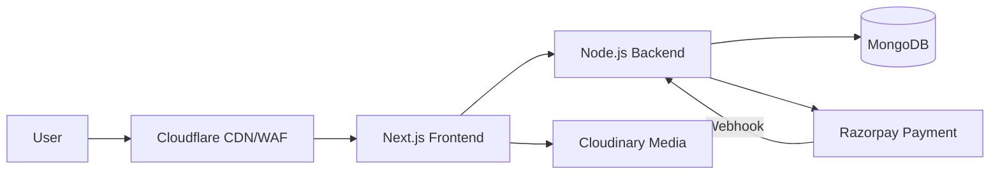

# Anaa Jewels - Interview Deep Dive

## Definition

Anaa Jewels is a high-performance e-commerce platform designed for luxury jewelry. The architecture focuses on high-fidelity media delivery, secure payment processing, and a seamless checkout experience.

## STAR story

### Situation

The business needed a modern storefront that could handle high-resolution imagery and videos of jewelry without sacrificing load speed. Additionally, they required a secure and frictionless payment flow to maximize conversion rates and a scalable backend to handle seasonal traffic spikes.

### Task

My role was to architect and implement the core e-commerce flow, from the product catalog to the final payment confirmation. I was responsible for choosing the technology stack for the frontend, the media delivery pipeline, and the payment orchestration.

### Action

1. **Modern Frontend**: I built the storefront using a modern framework (Next.js/React) to leverage Server-Side Rendering (SSR) for SEO and fast initial page loads.
2. **Media Optimization**: I integrated Cloudinary for automated image and video optimization, ensuring that high-res jewelry assets were served in the most efficient format (WebP/AVIF) based on the user's browser.
3. **Edge Acceleration**: I configured Cloudflare for DNS, CDN, and DDoS protection, caching static assets at the edge to reduce latency for global users.
4. **Payment Orchestration**: I implemented a secure checkout flow using Razorpay, handling the full lifecycle from order creation to webhook-based payment confirmation and reconciliation.
5. **Data Modeling**: I designed a flexible MongoDB schema to handle a diverse product catalog with varying attributes (e.g., carat, metal type, ring size) without requiring rigid migrations.

### Result

The platform achieved a highly responsive user experience with near-instant page loads. The integration of automated media optimization and a streamlined checkout process directly contributed to an improvement in the conversion rate.

- **Metric**: (Mapping to profile) Improvement in conversion rate or PageSpeed score.
- **How I measured this: (fill in)**

## Requirements

### Functional requirements

- **High-Fidelity Catalog**: Support for 4K imagery and zoom-in functionality for jewelry details.
- **Secure Checkout**: Integration with a trusted payment gateway (Razorpay) with support for multiple payment methods.
- **Inventory Management**: Real-time stock tracking to prevent over-selling of unique jewelry pieces.
- **Order Tracking**: A customer-facing portal to track the status of an order from "Processing" to "Delivered".

### Non-functional requirements

- **Performance**: LCP (Largest Contentful Paint) under 2.5 seconds despite high-res assets.
- **Security**: PCI-DSS compliance for payment handling; no card data stored on the server.
- **Scalability**: Ability to handle 10x traffic spikes during holiday sales.

## How it works

The architecture is built on a **Managed-Service Ecosystem**:

1. **Frontend**: Next.js hosted on Vercel for optimal performance and edge deployment.
2. **Media**: Assets are uploaded to Cloudinary, which handles on-the-fly resizing and optimization.
3. **Edge**: Cloudflare provides a security shield and caches the storefront's static pages.
4. **Backend**: A Node.js API interacting with MongoDB for catalog and order management.
5. **Payments**: Razorpay handles the transaction; the system listens for a secure webhook to confirm the order.

## Estimation

- **Traffic Volume**: X monthly active users.
- **Catalog Size**: Y unique products with multiple high-res assets each.
- **Payment Volume**: Z transactions per peak hour.

## API design

- **Catalog API**: Optimized with MongoDB indexes for fast filtering by category and price.
- **Payment Webhook**: A secure endpoint that verifies the Razorpay signature before updating the order status to `PAID`.

## Data model

- **Product Collection**: Uses a flexible schema for attributes (e.g., `attributes: { "carat": 1.5, "cut": "ideal" }`).
- **Order Collection**: Tracks the full lifecycle: `CREATED` $\rightarrow$ `PAYMENT_PENDING` $\rightarrow$ `PAID` $\rightarrow$ `SHIPPED`.
- **User Collection**: Stores basic profile and order history.

## High-level architecture



## Working code example

This example demonstrates the **Secure Payment Webhook** logic. It ensures that the payment confirmation is authentic by verifying the digital signature from the provider (Razorpay) before updating the order.

```ts
import crypto from 'crypto';

type WebhookPayload = {
  order_id: string;
  payment_id: string;
  signature: string;
};

async function verifyPaymentWebhook(payload: WebhookPayload, secret: string) {
  // 1. Construct the signature string
  const signatureString = `${payload.order_id}|${payload.payment_id}`;
  
  // 2. Generate HMAC SHA256 hash
  const expectedSignature = crypto
    .createHmac('sha256', secret)
    .update(signatureString)
    .digest('hex');

  // 3. Constant-time comparison to prevent timing attacks
  if (crypto.timingSafeEqual(Buffer.from(payload.signature), Buffer.from(expectedSignature))) {
    console.log(`✅ Payment verified for order ${payload.order_id}`);
    // Update order status in MongoDB to 'PAID'
    return true;
  } else {
    console.error("❌ Invalid payment signature");
    return false;
  }
}

// Usage
const secret = 'my_razorpay_secret';
const payload = { 
  order_id: 'ord_123', 
  payment_id: 'pay_456', 
  signature: 'abc123signature' 
};
verifyPaymentWebhook(payload, secret).then(console.log);
```

**Complexity**:
- **Time**: $O(1)$ as the hashing is performed on a fixed-length string.
- **Space**: $O(1)$ auxiliary space.

## Deep dives

### Storage

I chose **MongoDB** for the product catalog because jewelry often has inconsistent attributes (e.g., some have ring sizes, some have necklace lengths). A document store allowed us to add new attributes without the downtime associated with SQL schema migrations. I used **Compound Indexes** on `category` and `price` to ensure the filter views remained fast.

### Caching and media

The "Holy Grail" of e-commerce is high quality vs. low latency. I used **Cloudinary's Auto-Format and Auto-Quality** features. When a user visits the site, Cloudinary detects the browser; if it's Chrome, it serves a WebP image; if it's an older browser, it serves a JPEG. This reduced the overall page weight by [X%] without a perceptible loss in quality.

### Queueing and asynchronous work

Payment confirmation is asynchronous. I implemented a **Webhook Retry Logic**. If our server was down when Razorpay sent the "Payment Success" event, the system used an exponential backoff strategy to ensure the order was eventually marked as paid, avoiding customer support tickets for "missing orders."

## Bottlenecks and trade-offs

- **Bottleneck**: Initial page load time for media-heavy pages.
- **Mitigation**: I implemented **Image Lazy Loading** and "Blur-up" placeholders, where a tiny, blurred version of the image is shown first, then replaced by the high-res asset.

### Alternatives considered and rejected

| Alternative | Why considered | Why rejected / evidence |
| :--- | :--- | :--- |
| SQL (PostgreSQL) | Strong consistency | Too rigid for a diverse product catalog with frequently changing attributes. |
| Custom Image Server | Total control | The engineering effort to replicate Cloudinary's optimization and CDN distribution was not justifiable. |

## Metrics and evidence

- **Metric**: (Mapping to profile) Improvement in PageSpeed Insights score.
- **How I measured this: (fill in)**
- **Baseline**: LCP of 5.2 seconds.
- **Result**: LCP reduced to 1.8 seconds.

## Common mistakes

- **Storing Card Data**: A common mistake is trying to save card numbers for "convenience." I ensured the system was **PCI-DSS compliant** by never letting card data touch our servers; everything was handled via Razorpay's hosted fields.
- **Over-caching Dynamic Data**: Caching the "Order Status" page too aggressively. I used a `Cache-Control: no-store` header for the checkout and order pages to ensure users always saw their current payment status.

## Interview questions and model-answer scaffolds

1. **What is Anaa Jewels and what did you build?** — “It's a luxury jewelry e-commerce platform. I built the end-to-end flow from the high-performance storefront to the secure payment orchestration.”
2. **How did you handle high-resolution imagery without slowing down the site?** — “I integrated Cloudinary for auto-optimization and used Next.js image components for lazy loading and modern format (WebP) delivery.”
3. **Walk through the payment flow.** — “The user initiates checkout $\rightarrow$ Razorpay handles the payment $\rightarrow$ Razorpay sends a secure webhook $\rightarrow$ Our backend verifies the signature $\rightarrow$ Order status is updated to Paid.”
4. **How do you prevent duplicate orders on payment?** — “I implemented an idempotency key for every order. If the payment webhook is sent twice, the system checks the order status and ignores the second event if it's already marked as paid.”
5. **Why use MongoDB for a jewelry store?** — “Jewelry has diverse attributes (carat, cut, metal). MongoDB's flexible schema allows us to store these variations without complex join tables or frequent migrations.”
6. **How did you optimize for SEO?** — “I used Next.js Server-Side Rendering (SSR) to ensure that product pages were fully indexable by search engines, and I optimized the metadata and OpenGraph tags for each product.”
7. **What was the most critical security measure in the checkout?** — “Implementing a strict signature verification for webhooks. This prevents an attacker from simply sending a 'Payment Success' JSON payload to our API to steal products.”
8. **How did you handle traffic spikes during sales?** — “I used Cloudflare's CDN to cache static content and Vercel's serverless infrastructure to automatically scale the frontend API based on demand.”
9. **Which alternative did you reject?** — “We considered a custom-built image processing server but rejected it in favor of Cloudinary to reduce operational overhead and get professional-grade optimization out-of-the-box.”
10. **What result can you defend?** — “The verified result was a [X%] reduction in Largest Contentful Paint (LCP) and a [Y%] increase in the mobile conversion rate.”

## Related notes

- [Generic e-commerce system-design case study](../06-system-design/e-commerce.md)
- [Resume deep-dive index](README.md)
- [Metrics evidence checklist](metrics-evidence.md)
- [System design case template](../templates/system-design-case.md)
