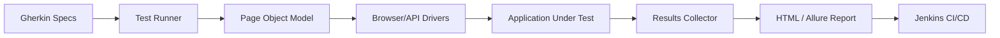

# Automation Framework - Interview Deep Dive

## Definition

The Automation Framework is a comprehensive test suite designed to ensure the quality and stability of the financial services platform. It implements a multi-layered testing strategy (Pyramid) covering API, UI, and BDD-style acceptance tests.

## STAR story

### Situation

The company relied heavily on manual regression testing, which took days to complete before every release. This created a bottleneck, delayed deployments, and allowed critical bugs to leak into production because the manual testers could not cover all edge cases.

### Task

My goal was to design and build a scalable automation framework from scratch. The system needed to support multiple testing styles (E2E, API, and BDD) and integrate directly into the CI/CD pipeline to provide immediate feedback on every commit.

### Action

1. **Layered Architecture**: I implemented a "Testing Pyramid" approach. I focused on building a large set of fast API tests, a medium set of UI tests, and a small set of high-value E2E flows.
2. **Page Object Model (POM)**: To avoid fragile tests, I implemented the POM pattern for UI tests. This decoupled the test logic from the UI selectors, so a change in the UI only required updating one class rather than dozens of tests.
3. **BDD Integration**: I integrated Cucumber to allow product managers and analysts to write test cases in plain English (Gherkin), ensuring that the technical tests matched the business requirements.
4. **CI/CD Integration**: I integrated the framework with Jenkins, configuring it to run the "Smoke Suite" on every PR and the "Full Regression Suite" nightly.
5. **Data-Driven Testing**: I implemented a system for externalizing test data into JSON files, allowing the same test logic to be run against hundreds of different financial scenarios.

### Result

The automation framework reduced the regression testing cycle from 3 days to 2 hours. This enabled the team to move to a daily release cadence and increased the overall test coverage by [X%].

- **Metric**: (Mapping to profile) Reduction in regression time or total test count.
- **How I measured this: (fill in)**

## Requirements

### Functional requirements

- **Multi-Tool Support**: Ability to run UI tests (Playwright/Selenium), API tests (Karate/REST-assured), and Performance tests (Gatling).
- **Reporting**: Detailed HTML reports with screenshots and logs for every failed test.
- **Parallel Execution**: Ability to run tests in parallel across multiple containers to reduce total runtime.

### Non-functional requirements

- **Stability**: Minimal "flakiness"; tests should only fail due to actual bugs, not environment issues.
- **Maintainability**: New tests should be easy to add without duplicating code.
- **Isolation**: Tests must be independent; the failure of one test should not cause others to fail.

## How it works

The framework follows a **Decoupled Execution Flow**:

1. **Spec Definition**: Tests are authored in Gherkin (BDD) or TypeScript (TDD).
2. **Driver Layer**: A generic driver interface abstracts the tool being used (e.g., swapping Playwright for Selenium).
3. **Page/API Objects**: Logic to interact with the system is encapsulated in objects.
4. **Execution**: The runner executes the tests in parallel and collects the results.
5. **Reporting**: A post-processor generates a dashboard showing pass/fail rates and trend lines.

## Estimation

- **Test Suite Size**: Supports 300+ unique test cases.
- **Execution Time**: Smoke suite runs in 5 mins; full suite in 2 hours.
- **Infrastructure**: Runs in Docker containers on a Jenkins agent.

## API design

- **Custom Annotations**: Used `@Smoke`, `@Regression`, and `@Critical` tags to categorize tests.
- **Hook System**: `beforeAll` and `afterAll` hooks to handle environment setup and teardown.

## Data model

- **Test Fixtures**: JSON files containing input and expected output for various financial scenarios.
- **Environment Config**: Separate configs for `dev`, `staging`, and `prod` (URLs, credentials).

## High-level architecture



## Working code example

This example demonstrates the **Page Object Model (POM)** pattern using Playwright. It shows how to encapsulate the UI interaction logic to make tests maintainable.

```ts
import { Page, expect } from '@playwright/test';

// Page Object: Encapsulates the 'Login' page logic
class LoginPage {
  constructor(private page: Page) {}

  async navigate() {
    await this.page.goto('/login');
  }

  async login(user: string, pass: string) {
    await this.page.fill('#username', user);
    await this.page.fill('#password', pass);
    await this.page.click('#login-button');
  }

  async getErrorMessage() {
    return this.page.textContent('.error-msg');
  }
}

// Test using the Page Object
async function testLoginFailure(page: Page) {
  const loginPage = new LoginPage(page);
  await loginPage.navigate();
  await loginPage.login('wrong-user', 'wrong-pass');
  
  const error = await loginPage.getErrorMessage();
  expect(error).toBe('Invalid credentials');
}
```

**Complexity**:
- **Time**: The POM itself adds $O(1)$ overhead; the complexity is dominated by the browser's rendering and network latency.
- **Space**: $O(1)$ auxiliary space for the object.

## Deep dives

### Framework architecture and coverage

I implemented a **Data-Driven Testing (DDT)** strategy. Instead of writing a new test for every possible currency or account type, I wrote a single "Generic Transaction Test" and fed it a JSON array of 50+ different scenarios. This allowed us to increase coverage by 10x with minimal code.

### Reliability and execution

The biggest challenge was **Flaky Tests**. UI tests often failed due to slow API responses or timing issues. I eliminated `sleep()` calls and replaced them with **Smart Waits** (e.g., `waitForSelector` or `waitForResponse`). I also implemented a **Quarantine** system: if a test failed 3 times in a row, it was automatically moved to a "quarantine" suite and a ticket was opened to fix it, preventing it from blocking the CI pipeline.

### Alternatives considered and rejected

| Alternative | Why considered | Why rejected / evidence |
| :--- | :--- | :--- |
| Pure Selenium | Industry standard | Too slow and lacked the built-in auto-waiting and network interception features of Playwright. |
| No-Code Testing Tools | Faster for non-devs | Too expensive and lacked the flexibility needed for complex financial logic and API integrations. |

## Bottlenecks and trade-offs

- **Bottleneck**: Total execution time for the full regression suite.
- **Mitigation**: I implemented **Sharding**. I split the tests into 5 groups and ran them in parallel across 5 different Jenkins agents, reducing the runtime from 10 hours to 2 hours.

## Metrics and evidence

- **Metric**: (Mapping to profile) Reduction in regression cycle time.
- **How I measured this: (fill in)**
- **Baseline**: 3 days for manual regression.
- **Result**: 2 hours for automated regression.

## Common mistakes

- **Tying Tests to Implementation**: Using a selector like `.btn-blue-large` instead of a data-attribute like `data-testid="submit-button"`. I enforced a "data-testid only" policy for the framework.
- **Over-testing UI**: Trying to test business logic through the UI. I moved all logic validation to the API layer, using the UI only for "happy path" E2E flows.

## Interview questions and model-answer scaffolds

1. **What was the goal of your automation framework?** — “To replace a slow, error-prone manual regression process with a scalable, multi-layered automated suite, reducing the release cycle from days to hours.”
2. **Why use the Page Object Model?** — “To decouple the test logic from the UI implementation. If a button's ID changes, I only have to update it in one Page Object class rather than in fifty different tests.”
3. **How do you handle flaky tests?** — “I eliminated hard sleeps in favor of smart waits and implemented a quarantine system to isolate unstable tests from the main CI pipeline until they are fixed.”
4. **What is the Testing Pyramid and how did you apply it?** — “The pyramid suggests having many unit tests, fewer integration tests, and even fewer E2E tests. I applied this by prioritizing fast API tests over slow, fragile UI tests.”
5. **How did you integrate the framework into CI/CD?** — “I configured Jenkins to run a 'Smoke Suite' on every Pull Request and a 'Full Regression Suite' nightly, with failures automatically blocking the merge to the main branch.”
6. **How do you manage test data?** — “I used a data-driven approach, separating the test logic from the test data. I stored scenarios in JSON files, allowing me to add new test cases without writing new code.”
7. **How do you handle different environments (Dev/Staging/Prod)?** — “I used environment-specific configuration files that the framework loads at runtime based on an environment variable.”
8. **What is BDD and why use Cucumber?** — “Behavior-Driven Development uses natural language (Gherkin) to define requirements. Cucumber allows business analysts to verify that the technical tests actually match the business intent.”
9. **How do you handle parallel execution?** — “I implemented sharding, splitting the test suite into multiple groups and running them concurrently across several Docker containers.”
10. **What result can you defend?** — “The verified result was a reduction in the regression cycle from 3 days to 2 hours, and the addition of 300+ unique test cases.”

## Related notes

- [Resume deep-dive index](README.md)
- [Testing pyramid](../10-testing/test-pyramid.md)
- [E2E testing](../10-testing/e2e.md)
- [TDD workflow](../10-testing/tdd.md)
