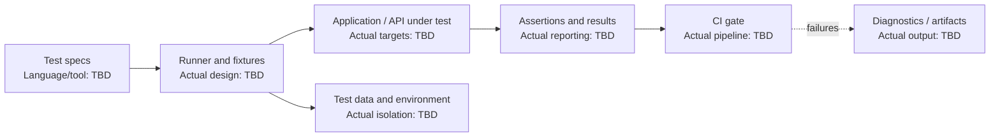

# Automation Framework - Interview Deep Dive

> **Evidence boundary:** The supplied profile names an “automation framework” and lists Selenium, Playwright, Cucumber, Karate, and Gatling as testing topics. It does not specify which tools were used in this project, framework architecture, test scope, personal contribution, or results. Do not associate any listed tool or the `300+ tests` metric with this project until verified.

## Definition

Automation framework is a named resume project. Its users, layers, supported applications, and responsibilities are **> TODO: verify**.

## STAR story (behavioral-story template)

### Situation

> TODO: verify — testing context, quality/release problem, and existing manual/automated coverage.

### Task

> TODO: verify — what you personally owned and success criteria.

### Action

> TODO: verify — actual framework design, test layers, fixtures/data, reporting, CI integration, and maintenance work.

### Result

> TODO: verify — verified outcome, attribution, and measurement source.

## Requirements (system-design-case template)

### Functional requirements

- > TODO: verify — actual test types, applications/APIs, environments, and reporting needs.

### Non-functional requirements

- > TODO: verify — reliability, runtime, parallelism, maintainability, isolation, and diagnostics constraints.

## How it works

> TODO: verify — explain the actual test authoring style, fixtures/setup, browser/API drivers, environment/data management, execution, reporting, and CI gate. The example below uses Node's built-in test runner only as a generic illustration; it does not claim the resume project used Node.js or this framework.

## Estimation

- Test count, runtime, parallel workers, or execution frequency: > TODO: verify
- Environment/data volume and source: > TODO: verify

## API design

- Framework's actual authoring/runner interface and configuration: > TODO: verify (or mark not applicable)
- CI invocation and reporting contract: > TODO: verify

## Data model

- Test data, fixtures, identities, environment configuration, and cleanup: > TODO: verify
- Isolation and privacy requirements: > TODO: verify

## High-level architecture

Generic framework structure for discussion only. Replace each stage using verified project facts.



## Working code example

Generic runnable JavaScript test using Node.js's built-in test runner (Node.js 18+). It has no third-party package dependency. This is not a claim about the resume framework.

```js
import test from 'node:test';
import assert from 'node:assert/strict';

function canRetry(statusCode) {
  return statusCode === 429 || statusCode >= 500;
}

test('retries throttling and server errors', () => {
  assert.equal(canRetry(429), true);
  assert.equal(canRetry(503), true);
  assert.equal(canRetry(400), false);
});
```

Save as `retry-policy.test.mjs` and run with `node --test retry-policy.test.mjs` on Node.js 18 or later. Complexity: this test makes a fixed number of assertions; `canRetry` takes $O(1)$ time and $O(1)$ space. Test-suite runtime/space depend on the suite and runner, so measure them rather than infer one global complexity.

## Deep dives

### Framework architecture and coverage

- Actual framework layers/tools and why selected: > TODO: verify
- Unit/integration/UI/API/performance responsibilities: > TODO: verify
- Page objects, screenplays, fixtures, or other abstractions actually used: > TODO: verify

### Reliability and execution

- Test-data setup/cleanup and isolation approach: > TODO: verify
- Flaky-test detection, retries, quarantining, and root-cause process: > TODO: verify
- CI execution, parallelization, artifacts, and failure reporting: > TODO: verify

### Alternatives considered and rejected

| Alternative | Why considered | Why rejected / evidence |
| --- | --- | --- |
| > TODO: verify | > TODO: verify | > TODO: verify |
| > TODO: verify | > TODO: verify | > TODO: verify |

### Bottlenecks and trade-offs

- Slow or flaky area and measured evidence: > TODO: verify
- Coverage vs runtime trade-off: > TODO: verify
- Maintainability vs abstraction trade-off: > TODO: verify

There is no single Big-O complexity for a test automation framework. Discuss verified test runtime, stability, maintenance cost, and feedback time. Project-specific trade-offs: > TODO: verify.

## Metrics and evidence

The profile lists `300+ tests` alongside other unassigned metrics. It does not establish that this framework produced that count.

- Metric associated with this project: > TODO: verify
- **How I measured this: (fill in)**
- Test-count definition (unique cases vs runs), baseline, period, source, ownership, and limitations: > TODO: verify

## Common mistakes

- Claiming a listed test tool was used without verifying its connection to this project.
- Reporting test executions as unique tests, or counting generated cases without explaining the definition.
- Using blind retries to mask flaky behavior rather than collecting diagnostics and fixing root causes.
- Coupling tests to implementation details or shared mutable test data.
- Quoting coverage, runtime, or defect metrics without measurement definitions and sources.

## Interview questions and model-answer scaffolds

Replace bracketed items with evidence from the real project.

1. **What problem did the automation framework solve?** — “It supported **[verified testing/release need]** for **[actual system/team]**; evidence was **[source]**.”
2. **Which test tools did it use, and why?** — “The project used **[verified tools]** because **[requirements/trade-offs]**.”
3. **How was the framework structured?** — “Tests flowed through **[actual runner/fixtures/drivers]** to **[real targets]**, with results reported by **[mechanism]**.”
4. **How did you manage test data and isolation?** — “We created/cleaned data using **[actual method]** and prevented cross-test interference through **[evidence]**.”
5. **How did you handle flaky tests?** — “We identified flakiness using **[actual signals]** and addressed root causes such as **[verified examples]**.”
6. **How did it run in CI?** — “The pipeline invoked **[actual command/stage]**, gated on **[verified rule]**, and retained **[artifacts]**.”
7. **How did you keep the suite maintainable?** — “We used **[actual abstraction/design rule]** and avoided **[verified maintenance problem]**.”
8. **Which alternative did you reject?** — “We considered **[real alternative]** and chose **[actual choice]** due to **[documented evidence]**.”
9. **How many tests were added or supported?** — “The verified count is **[definition and count]**; **How I measured this: (fill in)**; source: **[fill in]**.”
10. **What result did the framework produce?** — “The defensible outcome is **[verified result]**, measured over **[period]** against **[baseline/source]**.”

## Follow-up questions

Prepare a real test example, tool rationale, fixture/data lifecycle, CI flow, flake example, and metric definition. Keep unknowns as `> TODO: verify`.

## Related notes

- [Resume deep-dive index](README.md)
- [Testing pyramid](../10-testing/test-pyramid.md)
- [E2E testing](../10-testing/e2e.md)
- [TDD workflow](../10-testing/tdd.md)
