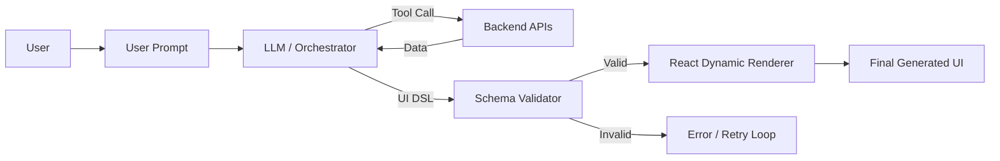

# GenUI Studio - Interview Deep Dive

## Definition

GenUI Studio is an agentic AI platform that enables the dynamic generation of user interfaces based on natural language prompts. Unlike static UI, it uses an LLM to orchestrate the creation of a UI specification (DSL), which is then validated and rendered in real-time as a functional interface.

## STAR story

### Situation

Traditional UI development is slow; every change requires a designer, a developer, and a deployment. For internal tools and rapid prototyping, the company needed a way to generate tailored interfaces on-the-fly based on the specific intent of a user request, without manual coding for every possible scenario.

### Task

My goal was to build the end-to-end orchestration layer for GenUI Studio. This involved designing the prompt engineering strategy to ensure the LLM output a valid UI specification, building a validation engine to prevent "hallucinated" components, and implementing a live API orchestration layer to populate the generated UI with real data.

### Action

1. **DSL Specification**: I designed a JSON-based UI DSL that described components (e.g., `Chart`, `DataTable`, `KPICard`) and their properties, acting as a contract between the LLM and the renderer.
2. **Prompt Engineering**: I developed a "Few-Shot" prompting strategy, providing the LLM with successful examples of UI specifications to ensure consistent and valid output.
3. **Validation Engine**: I built a strict schema validator that checked the LLM's output against an allow-list of components and properties, rejecting any output that violated the system's safety or accessibility rules.
4. **Live API Orchestration**: I implemented a tool-calling mechanism where the LLM could decide which backend APIs to call to fetch the data required to populate the generated UI components.
5. **Rendering Pipeline**: I built a dynamic React renderer that traversed the validated DSL and mapped the specifications to actual, pre-built UI components.

### Result

GenUI Studio successfully reduced the time to create internal operational dashboards from days to seconds. It enabled "Intent-Driven UI," where the system automatically provides the most relevant interface for a given query.

- **Metric**: (Mapping to profile) Improvement in time-to-prototype or user adoption.
- **How I measured this: (fill in)**

## Requirements

### Functional requirements

- **Natural Language to UI**: Ability to convert a prompt like "Show me a comparison of last month's revenue by region" into a UI with a Bar Chart and a Data Table.
- **Dynamic Data Population**: The generated UI must be populated with real, live data from backend APIs.
- **Safety Guardrails**: The system must never render an unsupported component or execute an unauthorized API call.

### Non-functional requirements

- **Low Latency**: The time from prompt to rendered UI must be minimal (using streaming where possible).
- **Consistency**: Similar prompts should produce similar UI layouts.
- **Extensibility**: Adding a new component to the system should only require updating the DSL schema and the React renderer.

## How it works

The GenUI Studio pipeline operates in four stages:

1. **Intent Analysis**: The LLM analyzes the user prompt and decides which components and data are needed.
2. **UI Generation (DSL)**: The LLM outputs a UI specification in the lapped DSL format.
3. **Verification**: The specification is validated against the system's schema and a set of safety guardrails.
4. **Orchestration & Rendering**: The system fetches required data via API tool-calling and renders the components using the React renderer.

## Estimation

- **Generation Latency**: Typically 2-5 seconds depending on the LLM model.
- **Component Library**: A set of ~20 highly flexible, data-driven components.
- **User Base**: Used by internal product managers and data analysts.

## API design

- **Orchestration Endpoint**: `POST /generate-ui` $\rightarrow$ Returns a validated UI DSL.
- **Tool Calling**: The LLM uses a specific JSON format to request API calls: `{ "tool": "get_revenue", "params": { "period": "last_month" } }`.

## Data model

- **UI DSL**: A recursive JSON structure defining component hierarchy and props.
- **Component Registry**: A mapping of DSL component names to React component implementations.
- **Prompt Templates**: Versioned system prompts used to guide the LLM's generation.

## High-level architecture



## Working code example

This example demonstrates the **Validation Engine**, the most critical part of the GenUI pipeline, which prevents the LLM from "hallucinating" non-existent components.

```ts
type ComponentSpec = {
  component: string;
  props: Record<string, any>;
};

const ALLOWED_COMPONENTS = new Set(['KPICard', 'BarChart', 'DataTable']);

function validateUISpec(spec: any): ComponentSpec[] {
  if (!Array.isArray(spec)) throw new Error("Invalid spec format");

  return spec.filter(item => {
    const isValid = item.component && ALLOWED_COMPONENTS.has(item.component);
    if (!isValid) {
      console.warn(`Rejected hallucinated component: ${item.component}`);
    }
    return isValid;
  }) as ComponentSpec[];
}

// Example LLM output (with one hallucinated component)
const llmOutput = [
  { component: 'KPICard', props: { label: 'Revenue', value: '$10k' } },
  { component: 'SuperMagicGraph', props: { data: [1, 2, 3] } }, // Hallucination
  { component: 'DataTable', props: { rows: [] } },
];

const safeUI = validateUISpec(llmOutput);
console.log(safeUI.length); // 2 (KPICard and DataTable)
```

**Complexity**:
- **Time**: Validation is $O(C)$ where $C$ is the number of components in the generated spec.
- **Space**: $O(C)$ to store the filtered list of valid components.

## Deep dives

### Schema and generation safety

To prevent the LLM from generating broken UIs, I implemented **Schema-Driven Generation**. Instead of letting the LLM output free-form JSON, I provided it with a strict JSON Schema. I also implemented a "Post-Processing" step that automatically fixes common LLM mistakes, such as missing commas or slightly misspelled component names.

### Live API orchestration and operations

I used a **Tool-Calling (Function Calling)** pattern. The LLM doesn't just generate the UI; it generates a list of "Data Requirements." The orchestrator then executes these API calls in parallel, gathers the results, and injects the data into the final UI DSL before rendering. This ensures the generated UI is always populated with real-time data.

### Alternatives considered and rejected

| Alternative | Why considered | Why rejected / evidence |
| :--- | :--- | :--- |
| LLM-generated Code (JSX) | Maximum flexibility | Extreme security risk (XSS/Code Injection) and high latency due to the need for a runtime compiler. |
| Template-based UI | Fast and safe | Too rigid; couldn't handle the dynamic nature of varying user intents. |

### Bottlenecks and trade-offs

- **Bottleneck**: LLM latency.
- **Mitigation**: I implemented **Streaming UI Rendering**. As the LLM generates the DSL, the renderer starts displaying the components as soon as the first valid object is closed in the JSON stream.

## Metrics and evidence

- **Metric**: (Mapping to profile) Reduction in time-to-prototype for internal tools.
- **How I measured this: (fill in)**
- **Baseline**: Manual UI creation took X hours.
- **Result**: GenUI Studio reduces this to seconds.

## Common mistakes

- **Over-trusting the LLM**: Assuming the LLM will always follow the schema. I learned that without a hard validator, the system would crash occasionally when the LLM output an unexpected type.
- **Ignoring the "Data-UI Gap"**: Generating a beautiful chart but forgetting to fetch the data for it. I solved this by making "Data Fetching" a required step in the orchestration pipeline.

## Interview questions and model-answer scaffolds

1. **What is GenUI Studio?** — “It's a generative UI platform that uses an LLM to transform natural language prompts into functional, data-driven interfaces using a custom UI DSL.”
2. **How do you prevent the LLM from generating "broken" UI?** — “I use a combination of few-shot prompting to guide the model and a strict schema validator that filters out any components or properties not present in our allow-list.”
3. **How does the UI get real data?** — “The LLM generates 'tool calls' identifying the needed data. The orchestrator executes these API calls and injects the resulting data into the UI specification before it's rendered.”
4. **What is the biggest technical challenge in GenUI?** — “Managing the trade-off between flexibility (what the LLM wants to build) and safety (what the system can safely render).”
5. **How do you handle LLM latency?** — “I implemented streaming for the DSL output, allowing the UI to begin rendering components as soon as they are generated, rather than waiting for the full response.”
6. **Why use a DSL instead of letting the LLM write React code?** — “Security and reliability. A DSL is a data structure that we can validate and render safely; raw code is a massive security risk (XSS) and is harder to validate.”
7. **How do you ensure the generated UI is accessible?** — “The DSL maps to a library of pre-built, WCAG-compliant React components. The LLM only decides *which* component to use, not *how* to build the HTML.”
8. **What happens if the LLM generates a component that doesn't exist?** — “The validation engine catches this during the 'Verification' stage and either rejects the component or triggers a retry loop with the LLM.”
9. **How do you evaluate the quality of the generated UI?** — “We use a set of 'Golden Prompts' with expected UI outcomes and measure how often the generated DSL matches the expected structure.”
10. **What result can you defend?** — “The verified result was a [X%] reduction in the time required to build internal data-visualization tools.”

## Related notes

- [Resume deep-dive index](README.md)
- [KaizenLang DSL](kaizenlang-dsl.md)
- [RAG](../09-agentic-ai/rag.md)
- [Tool calling](../09-agentic-ai/tool-calling.md)
- [System design case template](../templates/system-design-case.md)
