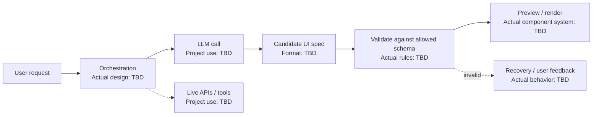

# GenUI Studio - Interview Deep Dive

> **Evidence boundary:** The supplied profile names “GenUI Studio” and describes interview focus in agentic AI/generative UI, custom DSL/schema design, LLM-driven UI generation, and live API orchestration. It does not map each capability to this project or provide implementation details, ownership, outcomes, or metric mapping. Confirm which capabilities belong to GenUI Studio before claiming them. All unknowns remain `> TODO: verify`.

## Definition

GenUI Studio is a named resume project. Its exact users, product boundary, and responsibilities are **> TODO: verify**.

## STAR story (behavioral-story template)

### Situation

> TODO: verify — user need, product context, existing workflow, and constraints.

### Task

> TODO: verify — your own ownership and the intended outcome.

### Action

> TODO: verify — which of UI generation, schema/DSL, LLM integration, API orchestration, validation, and evaluation you personally delivered.

### Result

> TODO: verify — evidence-backed result, attribution, and measurement source.

## Requirements (system-design-case template)

### Functional requirements

- > TODO: verify — actual users, inputs, generated artifacts, editing/preview flow, and integrations.

### Non-functional requirements

- > TODO: verify — safety, latency, reliability, accessibility, privacy, cost, and maintainability requirements that applied.

## How it works

> TODO: verify — document the actual user request, model/tool orchestration, schema/DSL validation, rendering/preview, API calls, error handling, and human review. The generic flow below is not a factual description of the implementation.

## Estimation

- Users, generation volume, request size, and concurrency: > TODO: verify
- Latency/cost constraints and measurement source: > TODO: verify

## API design

- Actual model/API/tool interfaces and request/response contracts: > TODO: verify
- Authentication, authorization, rate limits, and idempotency: > TODO: verify (or mark not applicable with evidence)

## Data model

- Actual UI schema, DSL representation, persistence, and versioning: > TODO: verify
- Validation and compatibility constraints: > TODO: verify

## High-level architecture

Generic illustration only. Verify every stage, especially whether this project used a DSL, tools, live APIs, or an LLM in this flow.



## Working code example

This runnable TypeScript function demonstrates **one generic safety boundary**: accept JSON only when its component name is allow-listed. It is not GenUI Studio code and does not define the project's real schema. Production validation must also verify each component's props, nested data, permissions, and resource limits.

```ts
type ComponentSpec = {
  component: string;
  props: Record<string, unknown>;
};

const allowedComponents = new Set(["Text", "Button"]);

function parseComponentSpec(json: string): ComponentSpec | null {
  let value: unknown;
  try {
    value = JSON.parse(json);
  } catch {
    return null;
  }

  if (typeof value !== "object" || value === null || Array.isArray(value)) return null;
  const candidate = value as Record<string, unknown>;
  if (typeof candidate.component !== "string" || !allowedComponents.has(candidate.component)) return null;
  if (typeof candidate.props !== "object" || candidate.props === null || Array.isArray(candidate.props)) return null;

  return { component: candidate.component, props: candidate.props as Record<string, unknown> };
}

const result = parseComponentSpec('{"component":"Button","props":{"label":"Save"}}');
console.log(result?.component ?? "rejected");
```

Expected output: `Button`.

Complexity: for JSON input length $n$ and $p$ top-level properties, parsing and object checks are $O(n + p)$ time; the parsed object uses $O(n)$ space. This example does not enforce a complete schema or authorize actions.

## Deep dives

### Schema and generation safety

- Actual generation constraints, allowed component vocabulary, and validation: > TODO: verify
- How unsupported/invalid model output was handled: > TODO: verify
- Accessibility and responsive behavior checks: > TODO: verify (or explain not applicable)

### Live API orchestration and operations

- Actual APIs/tools invoked and data exposure controls: > TODO: verify
- Timeouts, retries, partial failures, and user-visible recovery: > TODO: verify
- Logging, privacy, evaluation, and rollout: > TODO: verify

### Alternatives considered and rejected

| Alternative | Why considered | Why rejected / evidence |
| --- | --- | --- |
| > TODO: verify | > TODO: verify | > TODO: verify |
| > TODO: verify | > TODO: verify | > TODO: verify |

### Bottlenecks and trade-offs

- Quality vs latency/cost: actual decision and evidence > TODO: verify
- Flexibility vs schema safety: > TODO: verify
- API orchestration bottleneck/failure mode: > TODO: verify

There is no single Big-O complexity for an LLM-backed UI product. Discuss measured latency/cost and the complexity of verified validation/rendering code separately. Project trade-offs: > TODO: verify.

## Metrics and evidence

The supplied profile lists `60%`, `45%`, `85%`, `4x`, `300+ tests`, and `120+ users` without assigning metrics to GenUI Studio.

- Metric associated with this project: > TODO: verify
- **How I measured this: (fill in)**
- Baseline, definition/formula, time period, source, attribution, and limitations: > TODO: verify

## Common mistakes

- Claiming every generative-UI capability in the profile belonged to GenUI Studio without confirming the mapping.
- Treating valid JSON or an allow-listed component name as sufficient schema/security validation.
- Allowing model output to choose arbitrary components, props, URLs, or side effects without a verified policy.
- Describing retries/caching/streaming as implemented when they are only possible design options.
- Quoting quality, latency, adoption, or cost metrics without a baseline and measurement evidence.

## Interview questions and model-answer scaffolds

Use only verified project facts in bracketed fields.

1. **What is GenUI Studio, and who used it?** — “It was **[verified product/purpose]** for **[verified users]**; the user problem was **[evidence]**.”
2. **What part did you personally own?** — “I owned **[specific component/work]** and collaborated with **[verified roles]**.”
3. **How was the UI produced?** — “The actual flow was **[verified input-to-output stages]**; the output contract was **[verified format]**.”
4. **How did you constrain model output?** — “We allowed **[verified schema/capabilities]** and rejected **[verified invalid cases]** at **[actual boundary]**.”
5. **How were live API calls orchestrated?** — “The project called **[verified APIs/tools]** through **[actual mechanism]**, with **[verified authorization/data limits]**.”
6. **How did the design handle malformed or unavailable output?** — “The observed failure was **[case]**; the actual recovery was **[behavior]**.”
7. **What alternatives did you evaluate?** — “We considered **[real alternative]** and selected **[actual decision]** because **[documented trade-off]**.”
8. **How did you evaluate generated UI quality and safety?** — “We measured **[verified criteria]** using **[actual method/data]**; limitations were **[known limits]**.”
9. **What was the most important trade-off?** — “We balanced **[verified concerns]** by **[actual decision]**, supported by **[evidence]**.”
10. **What result can you defend?** — “The verified result was **[outcome/metric]**. **How I measured this: (fill in)**; baseline/source: **[fill in]**.”

## Follow-up questions

Prepare a verified architecture, one approved non-sensitive input/output example, validation rules, API/tool boundaries, failure cases, evaluation evidence, and metric source. Unconfirmed details remain `> TODO: verify`.

## Related notes

- [Resume deep-dive index](README.md)
- [KaizenLang DSL](kaizenlang-dsl.md)
- [RAG](../09-agentic-ai/rag.md)
- [Tool calling](../09-agentic-ai/tool-calling.md)
