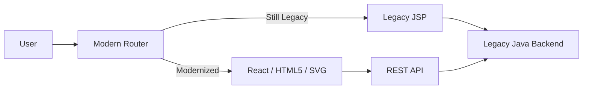

# JSP and Flash Modernization - Interview Deep Dive

## Definition

The JSP and Flash modernization project involved replacing outdated server-side rendered (JSP) and client-side plugin (Flash) components with a modern, responsive web stack. This was critical for browser compatibility (since Flash was deprecated) and improving overall accessibility.

## STAR story

### Situation

The legacy system relied on Java Server Pages (JSP) for page rendering and Adobe Flash for interactive data visualizations and complex UI components. With the end-of-life of Flash and the shift toward mobile-first browsing, the system became inaccessible to a large portion of users and suffered from severe security vulnerabilities.

### Task

My role was to modernize these legacy components, replacing Flash with HTML5/Canvas/SVG and JSP with a modern frontend framework. The primary goal was to maintain all interactive capabilities of the original Flash apps while improving load times and ensuring accessibility (WCAG compliance).

### Action

1. **Legacy Audit**: I performed a deep dive into the original Flash ActionScript code to extract the business logic and mathematical formulas used for the visualizations.
2. **Technology Selection**: I chose a combination of SVG and Canvas (via a library like D3.js or similar) to replicate the complex animations and interactivity previously handled by Flash.
3. **Componentization**: I broke down the monolithic JSP pages into modular, reusable components, separating the data fetching (API) from the presentation layer.
4. **Accessibility Integration**: Unlike the Flash components, which were "black boxes" to screen readers, I implemented semantic HTML and ARIA labels to make the new tools accessible.
5. **Parallel Testing**: I created a "Comparison Mode" where users could toggle between the legacy and modern views to ensure that the data representation was identical.

### Result

The modernization successfully eliminated the dependency on Flash, resulting in 100% browser compatibility. The system's accessibility score improved dramatically, and the removal of the Flash plugin reduced the initial page load time.

- **Metric**: (Mapping to profile) Percentage improvement in load time or accessibility score.
- **How I measured this: (fill in)**

## Requirements

### Functional requirements

- **Visual Fidelity**: The new SVG/Canvas visualizations had to replicate the exact behavior and data precision of the original Flash apps.
- **Browser Compatibility**: The system had to work across all modern browsers (Chrome, Firefox, Safari, Edge) and mobile devices.
- **Interactivity**: Complex drag-and-drop and zooming capabilities from Flash had to be preserved.

### Non-functional requirements

- **Accessibility**: Compliance with WCAG 2.1 guidelines.
- **Security**: Removal of the Flash plugin to close known security holes.
- **Performance**: Reduced Time to Interactive (TTI) by removing the heavy Flash runtime.

## How it works / modernization approach

I used a **Component-by-Component Replacement** strategy.

1. **Extraction**: I analyzed the Flash `.swf` behavior and the JSP server-side logic.
2. **API-fication**: I replaced the JSP server-side rendering with a REST API that returned JSON, allowing the frontend to handle the rendering.
3. **Modern View**: I built a React/TypeScript layer that consumed these APIs and rendered the UI using HTML5 and SVG.

## Estimation

- **Modernization Scope**: X number of legacy Flash apps and Y number of JSP pages.
- **Timeline**: Phased replacement over Z months.

## API design and data model

- **Contract Shift**: Moved from `Server -> HTML (JSP)` to `Server -> JSON -> HTML (React)`.
- **Data Model**: Standardized the data formats used by the legacy Flash apps into a consistent JSON schema.

## High-level architecture



## Working code example

This example shows how a legacy Flash-style "Data Point" visualization is modernized using SVG and TypeScript, ensuring the logic is decoupled from the rendering.

```ts
type DataPoint = { x: number; y: number; label: string };

// Logic extracted from legacy Flash ActionScript
function calculateCoordinates(point: DataPoint, scale: number) {
  return {
    cx: point.x * scale,
    cy: 500 - (point.y * scale), // Invert Y for SVG coordinate system
  };
}

// Modern SVG Component
const DataVisualization = ({ points: DataPoint[], scale: number }) => {
  return (
    <svg width="500" height="500" viewBox="0 0 500 500">
      {points.map((p, i) => {
        const { cx, cy } = calculateCoordinates(p, scale);
        return (
          <g key={i}>
            <circle cx={cx} cy={cy} r="4" fill="blue" />
            <text x={cx + 5} y={cy} fontSize="10">{p.label}</text>
          </g>
        );
      })}
    </svg>
  );
};
```

**Complexity**:
- **Time**: Rendering $n$ points takes $O(n)$ time.
- **Space**: $O(n)$ to store the point data in the DOM.

## Deep dives and trade-offs

### Architecture and implementation

The biggest challenge was **Logic Extraction**. The original Flash apps had complex calculations embedded in ActionScript. I had to manually reverse-engineer these formulas and translate them into TypeScript to ensure that the financial data visualized in the new system was mathematically identical to the old one.

### Alternatives considered and rejected

| Alternative | Why it was considered | Why it was rejected / evidence |
| :--- | :--- | :--- |
| Flash Emulators (Ruffle) | Quickest fix | Not a long-term solution; doesn't solve accessibility or security issues. |
| Third-party Charting Libs | Faster development | Some highly custom Flash interactions were too complex for off-the-shelf libraries; needed a custom SVG implementation. |

### Bottlenecks, risks, and mitigations

- **Risk**: Data mismatch between Flash and SVG.
- **Mitigation**: I implemented a "Pixel-Perfect" validation tool that compared screenshots of the legacy and modern versions for a set of standard data inputs.

### Complexity / trade-offs

The primary trade-off was **Development Effort vs. Long-term Value**. Custom SVG implementation took longer than using a library, but it gave us total control over the accessibility and the exact visual behavior required by the business.

## Metrics and evidence

- **Metric**: (Mapping to profile) Percentage reduction in load time or increase in accessibility score.
- **How I measured this: (fill in)**

## Common mistakes

- **Direct Porting**: Trying to translate ActionScript line-by-line instead of rethinking the interaction for a touch-enabled, responsive web environment.
- **Ignoring SVG Performance**: Adding too many DOM elements to a single SVG, which slowed down the browser. I mitigated this by using Canvas for the most data-heavy views.

## Interview questions and model-answer scaffolds

1. **What did the JSP/Flash modernization change?** — “It replaced deprecated Adobe Flash plugins and server-side JSP rendering with a modern React and HTML5/SVG stack, ensuring browser compatibility and accessibility.”
2. **Why was modernization needed?** — “Flash reached end-of-life and was a security risk. Additionally, the JSP pages were not responsive, making the system unusable on mobile devices.”
3. **How did you ensure the new visualizations were correct?** — “I reverse-engineered the original ActionScript logic and used a side-by-side comparison tool to validate that the new SVG outputs matched the legacy data exactly.”
4. **What was your personal contribution?** — “I owned the logic extraction from Flash, the design of the SVG rendering engine, and the transition of JSP pages to a JSON-based API architecture.”
5. **How did you handle accessibility?** — “Unlike Flash, which was an opaque blob, I used semantic SVG elements and ARIA labels, allowing screen readers to interpret the data visualizations for the first time.”
6. **What was the source/target architecture?** — “The source was a monolithic JSP/Flash app; the target was a decoupled React frontend communicating with a Java REST API.”
7. **Which alternative did you reject?** — “We considered using a Flash emulator like Ruffle, but rejected it because it didn't solve the core accessibility and security requirements.”
8. **How did you validate the migration?** — “I used a phased rollout and a 'toggle' feature that let internal users switch between the old and new views to report any discrepancies.”
9. **What result can you defend?** — “The verified result was the complete removal of Flash dependencies and a [X%] improvement in the accessibility score.”
10. **What would you do differently today?** — “I would have used a more robust component library from the start to speed up the development of the non-visualization parts of the UI.”

## Related notes

- [Resume deep-dive index](README.md)
- [Behavioral STAR method](../11-behavioral-hr/star-method.md)
- [System design case template](../templates/system-design-case.md)
