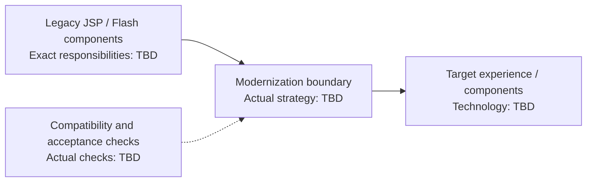

# JSP and Flash Modernization - Interview Deep Dive

> **Evidence boundary:** The supplied resume profile names “JSP/Flash migration” only. It does not specify which product used which technology, the target stack, scope, migration method, personal contribution, or outcomes. The project wording below is a label, not a claim about implementation details. Verify every project-specific field before using it in an interview.

## Definition

JSP/Flash modernization is a named resume project. The exact legacy components and the modernization target are **> TODO: verify**.

## STAR story (behavioral-story template)

### Situation

> TODO: verify — what the JSP/Flash system did, users/business context, constraints, and reason for change.

### Task

> TODO: verify — your assigned responsibilities and success criteria.

### Action

> TODO: verify — actual discovery, migration, compatibility, testing, and rollout work you personally performed.

### Result

> TODO: verify — substantiated outcomes and evidence. Avoid undocumented performance, adoption, or delivery claims.

## Requirements (system-design-case template)

### Functional requirements

- > TODO: verify — capabilities that had to remain available or change during modernization.

### Non-functional requirements

- > TODO: verify — browser/device support, accessibility, security, performance, availability, maintainability, or other constraints that actually applied.

## How it works / modernization approach

> TODO: verify — document the actual inventory, target components, coexistence or cutover method, state/data handling, testing, and rollback plan. Do not assume Flash was embedded in JSP or that the destination was React unless the resume/project evidence confirms it.

## Estimation

- Screens/modules/users/assets migrated: > TODO: verify
- Duration, release stages, and constraints: > TODO: verify
- Source for estimates: > TODO: verify

## API design and data model

- Relevant interfaces, server endpoints, or integration contracts: > TODO: verify (or explain why not applicable)
- State, data, asset, or persistence changes: > TODO: verify (or explain why not applicable)

## High-level architecture

The source and target nodes below are intentionally placeholders. This is not an inferred architecture; replace the labels and boundary with facts from the project.



## Working code example

This runnable TypeScript evidence checklist is a preparation aid, **not code from the project** and does not assert the target used TypeScript.

```ts
type ModernizationEvidence = {
  legacyResponsibilities: string;
  targetResponsibilities: string;
  compatibilityPlan: string;
  rolloutEvidence: string;
};

function isInterviewReady(evidence: ModernizationEvidence): boolean {
  return Object.values(evidence).every((value) => value.trim().length > 0);
}

const evidence: ModernizationEvidence = {
  legacyResponsibilities: "",
  targetResponsibilities: "",
  compatibilityPlan: "",
  rolloutEvidence: "",
};

console.log(isInterviewReady(evidence));
```

Complexity: for $k$ evidence fields, time is $O(k)$ and extra space is $O(1)$, excluding the fixed input object.

## Deep dives and trade-offs

### Architecture and implementation

- Legacy responsibilities and dependencies: > TODO: verify
- Target architecture and migration boundary: > TODO: verify
- Browser/runtime compatibility and transition behavior: > TODO: verify

### Alternatives considered and rejected

| Alternative | Why it was considered | Why it was rejected / evidence |
| --- | --- | --- |
| > TODO: verify | > TODO: verify | > TODO: verify |
| > TODO: verify | > TODO: verify | > TODO: verify |

### Bottlenecks, risks, and mitigations

- Compatibility/accessibility/security risk that actually applied: > TODO: verify
- How the risk was found: > TODO: verify
- Mitigation and evidence of effectiveness: > TODO: verify

### Complexity / trade-offs

End-to-end modernization has no single Big-O complexity. Explain verified trade-offs among compatibility, scope, user disruption, maintainability, accessibility, security, and rollout risk. Project-specific trade-offs: > TODO: verify.

## Metrics and evidence

The supplied profile lists `60%`, `45%`, `85%`, `4x`, `300+ tests`, and `120+ users` without mapping them to this project.

- Metric associated with this project: > TODO: verify (do not infer a mapping)
- **How I measured this: (fill in)**
- Baseline, calculation, measurement period, source, attribution, and limitations: > TODO: verify

## Common mistakes

- Assuming a particular target framework or claiming a full rewrite without verifying the actual migration.
- Treating JSP and Flash as one inseparable component without confirming their roles.
- Omitting compatibility, accessibility, security, or rollback issues that were actually encountered.
- Quoting a project metric without being able to explain its definition and source.
- Presenting the architecture placeholder as if it were the real project design.

## Interview questions and model-answer scaffolds

These are non-fabricated answer structures. Replace bracketed fields with verified evidence.

1. **What did the JSP/Flash modernization change?** — “It changed **[verified legacy capability]** to **[verified target capability]** to address **[verified reason]**.”
2. **Why was modernization needed?** — “The concrete constraint was **[evidence]**; the expected result was **[verified success criterion]**.”
3. **How did you decide what to migrate first?** — “We prioritized using **[actual criterion]**, with **[verified dependency or risk]** considered.”
4. **What was your personal contribution?** — “I was responsible for **[specific work]** and collaborated with **[verified roles/team]**.”
5. **What was the source/target architecture?** — “The legacy responsibilities were **[facts]**; the target was **[facts]**. I will draw the verified boundary rather than assume one.”
6. **How did you handle compatibility?** — “We had to support **[verified browsers/users/contracts]** and used **[actual approach]**.”
7. **What alternatives did you consider?** — “We considered **[real alternative]** and rejected it because **[documented trade-off]**.”
8. **How did you validate the migration?** — “We checked **[actual behaviors]** using **[actual tests/evidence]**; known gaps were **[verified limitations]**.”
9. **What result or metric can you defend?** — “The verified result is **[metric/outcome]**. **How I measured this: (fill in)**; source and baseline: **[fill in]**.”
10. **What was the hardest risk, and what did you learn?** — “The hardest verified risk was **[risk]**. I responded with **[action]** and learned **[specific lesson]**.”

## Follow-up questions

Prepare evidence for the actual target stack, migration boundary, validation, user impact, accessibility/security implications, and release approach. Do not claim an answer until project facts are confirmed.

## Related notes

- [Resume deep-dive index](README.md)
- [Behavioral STAR method](../11-behavioral-hr/star-method.md)
- [System design case template](../templates/system-design-case.md)
