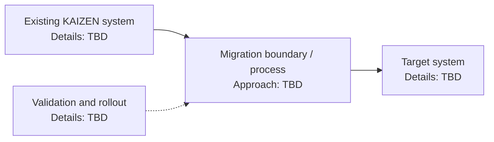

# KAIZEN Migration - Interview Deep Dive

> **Evidence boundary:** The supplied resume profile names “KAIZEN migration” only. It does not provide the problem, stack, architecture, personal contribution, migration method, alternatives, outcome, or metric mapping. Replace each placeholder with verified resume/project facts. Do not infer that this was a frontend migration or assign a listed metric to it without confirmation.

## Definition

KAIZEN migration is a named resume project. The system being migrated and the meaning/scope of “KAIZEN” are **> TODO: verify**.

## STAR story (behavioral-story template)

### Situation

> TODO: verify — system, users, business context, constraints, and why a migration was required.

### Task

> TODO: verify — your own responsibility and the outcome agreed with the team.

### Action

> TODO: verify — steps you personally took, collaboration, decisions, validation, and rollout.

### Result

> TODO: verify — verified outcome and evidence source. Do not attribute team results solely to yourself.

## Requirements (system-design-case template)

### Functional requirements

- > TODO: verify — what the existing system did and what the migrated system had to preserve or add.

### Non-functional requirements

- > TODO: verify — availability, performance, security, compatibility, maintainability, and migration constraints that actually applied.

## How it works / migration approach

> TODO: verify — describe the actual migration stages, boundaries, data/state handling, compatibility plan, validation, and rollout. Do not use a generic strangler, rewrite, or parallel-run strategy as a claim unless it matches the project.

## Estimation

- Users / traffic / data volume: > TODO: verify
- Migration duration and rollout window: > TODO: verify
- Assumptions and source: > TODO: verify

## API design and data model

- Relevant interfaces/endpoints and contract changes: > TODO: verify (or mark not applicable with reason)
- Important entities, storage, schema changes, and compatibility requirements: > TODO: verify (or mark not applicable with reason)

## High-level architecture

This diagram is a **placeholder structure only**, not a description of the actual system. Replace every TBD node using verified project facts.



## Working code example

The following runnable TypeScript helper is an interview-preparation aid for checking that evidence has been collected. It is **not** project code and does not claim that this migration used TypeScript.

```ts
type MigrationEvidence = {
  sourceSystem: string;
  targetSystem: string;
  personalContribution: string;
  validationEvidence: string;
};

function missingEvidence(evidence: MigrationEvidence): string[] {
  return Object.entries(evidence)
    .filter(([, value]) => value.trim().length === 0)
    .map(([field]) => field);
}

const evidence: MigrationEvidence = {
  sourceSystem: "",
  targetSystem: "",
  personalContribution: "",
  validationEvidence: "",
};

console.log(missingEvidence(evidence));
```

Complexity: for $k$ evidence fields, time is $O(k)$ and extra space is $O(k)$ in the worst case for the returned missing-field list.

## Deep dives and trade-offs

### Architecture and implementation

- Actual architecture and migration seam: > TODO: verify
- What had to remain compatible during transition: > TODO: verify
- Data/state migration or coexistence requirements: > TODO: verify

### Alternatives considered and rejected

| Alternative | Why it was considered | Why it was rejected / evidence |
| --- | --- | --- |
| > TODO: verify | > TODO: verify | > TODO: verify |
| > TODO: verify | > TODO: verify | > TODO: verify |

### Bottlenecks, risks, and mitigations

- Risk or bottleneck: > TODO: verify
- How it was detected: > TODO: verify
- Mitigation and observed result: > TODO: verify

### Complexity / trade-offs

There is no single Big-O complexity for an end-to-end system migration. Record the verified engineering trade-offs: delivery risk, compatibility, operational load, performance, maintainability, and migration cost. Project-specific trade-offs: > TODO: verify.

## Metrics and evidence

The supplied profile lists these metrics without assigning them to this project: `60%`, `45%`, `85%`, `4x`, `300+ tests`, `120+ users`.

- Metric associated with this project: > TODO: verify (do not select one without source evidence)
- **How I measured this: (fill in)**
- Baseline, numerator/denominator or formula, time period, source, attribution, and limitations: > TODO: verify

## Common mistakes

- Claiming a team outcome as an individual result without explaining your contribution.
- Describing an ideal migration pattern instead of the one actually used.
- Quoting a percentage without a baseline, formula, source, period, and scope.
- Omitting compatibility, rollback, or validation details when they applied.
- Treating the architecture placeholder above as project evidence.

## Interview questions and model-answer scaffolds

These are safe scaffolds, not factual claims. Fill the bracketed parts from your verified experience.

1. **What was the KAIZEN migration?** — “The project moved **[verified source]** to **[verified target]** because **[verified need]**. My role was **[verified responsibility]**.”
2. **What problem made the migration necessary?** — “The evidence was **[verified constraint or incident]**; the project goal was **[verified outcome]**.”
3. **What did you personally own?** — “I owned **[specific work]**, coordinated with **[verified collaborators]**, and validated it using **[evidence]**.”
4. **How did you plan the migration?** — “We used **[actual sequence]**. Each stage was gated by **[verified validation]**.”
5. **What architecture did the source and target use?** — “The source was **[verified design]** and the target was **[verified design]**; the diagram is pending those facts.”
6. **Which alternative did you reject and why?** — “We considered **[real alternative]**; we chose **[actual choice]** because **[evidence-based trade-off]**.”
7. **How did you reduce migration risk?** — “We addressed **[verified risk]** with **[actual mitigation]**, and checked **[actual signal/test]**.”
8. **How did you test correctness?** — “We used **[actual test/validation method]**; the result and scope were **[verified evidence]**.”
9. **What metric improved, and how was it measured?** — “The project metric was **[verified metric]**. **How I measured this: (fill in)**; baseline and source are **[fill in]**.”
10. **What would you change if doing it again?** — “Given **[verified constraint or learning]**, I would change **[specific step]** and validate it by **[measure]**.”

## Follow-up questions

Be ready to support each answer with a concrete artifact, decision, or measurement. Unknown answers remain `> TODO: verify` rather than guessed.

## Related notes

- [Resume deep-dive index](README.md)
- [Behavioral STAR method](../11-behavioral-hr/star-method.md)
- [System design case template](../templates/system-design-case.md)
