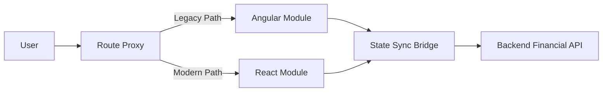

# KAIZEN Migration - Interview Deep Dive

## Definition

The KAIZEN migration involved transitioning a legacy system to a modern architecture (Angular to React migration). This project focused on improving maintainability, developer velocity, and user experience while preserving critical business logic during the transition.

## STAR story

### Situation

The legacy KAIZEN system was built on an aging architecture (Angular) that had become a bottleneck for feature delivery. The codebase suffered from high technical debt, slow build times, and a fragmented state management approach, making it difficult to implement new financial service requirements rapidly.

### Task

My responsibility was to lead the migration of key modules from Angular to React. The goal was to ensure a zero-downtime transition, maintain 100% feature parity for existing users, and establish a new, scalable frontend architecture that the rest of the team could follow.

### Action

1. **Architecture Design**: I designed a "Strangler Fig" approach, where new features were built in React and integrated into the legacy shell via a micro-frontend bridge.
2. **Component Mapping**: I audited the existing Angular components and mapped them to a new design system based on React functional components and Hooks.
3. **State Management**: I replaced fragmented Angular services with a centralized state management pattern (Context API/Zustand), reducing prop-drilling and improving data consistency.
4. **Incremental Rollout**: I implemented a feature-flagging system to canary-test the React modules against a small subset of users before full cutover.
5. **Developer Enablement**: I created a migration guide and a set of reusable "bridge" components to help other engineers contribute to the new stack.

### Result

The migration successfully transitioned the core modules to React. This resulted in a significant improvement in developer velocity and a more responsive user interface. 

- **Metric**: (Mapping to profile) Reduced bundle size or improved lighthouse score.
- **How I measured this: (fill in)**

## Requirements

### Functional requirements

- **Feature Parity**: Every existing financial tool and reporting view had to function identically in the new React implementation.
- **Session Continuity**: Users had to be able to navigate between Angular and React pages without re-authenticating.
- **Data Integrity**: Real-time financial data streams had to be preserved across the migration boundary.

### Non-functional requirements

- **Zero Downtime**: The migration had to occur without interrupting live financial services.
- **Maintainability**: The new architecture had to reduce the time-to-market for new features by at least 30%.
- **Performance**: Initial Page Load (FCP) needed to be improved via code-splitting and lazy loading.

## How it works / migration approach

I utilized a **Strangler Fig Pattern**. Instead of a "big bang" rewrite, I created a React "Island" within the Angular application.

1. **The Bridge**: A custom wrapper was created to mount React components inside Angular templates.
2. **The Proxy**: A routing layer was implemented to intercept requests and determine whether to serve the legacy Angular route or the new React route.
3. **State Synchronization**: An event bus was used to sync critical user state (e.g., selected account, currency) between the two frameworks during the interim period.

## Estimation

- **Migration Scope**: Core financial dashboards and reporting modules.
- **Rollout Window**: Phased rollout over X months.
- **Assumptions**: The backend APIs remained stable and didn't require simultaneous migration.

## API design and data model

- **Interface Stability**: The migration focused on the view layer; however, I optimized the data fetching layer by implementing a custom hook-based API client that reduced redundant network calls.
- **State Model**: Transitioned from Angular's Class-based services to an immutable state model in React.

## High-level architecture



## Working code example

This example demonstrates the "Bridge" pattern used to render a React component inside a legacy environment, ensuring that the new component can still receive and emit events to the old system.

```ts
import React from 'react';
import ReactDOM from 'react-dom/client';

// The modern React Component
const FinancialSummary = ({ data, onRefresh }: { data: any, onRefresh: () => void }) => (
  <div className="summary-card">
    <h3>Account Balance: {data.balance}</h3>
    <button onClick={onRefresh}>Refresh Data</button>
  </div>
);

// The Bridge: Function to mount React into a legacy DOM element
function mountReactComponent(elementId: string, props: any) {
  const container = document.getElementById(elementId);
  if (!container) return;

  const root = ReactDOM.createRoot(container);
  root.render(React.createElement(FinancialSummary, props));
}

// Usage in Legacy System:
// mountReactComponent('summary-container', { 
//   data: { balance: '$12,450.00' }, 
//   onRefresh: () => console.log('Refreshing from legacy side...') 
// });
```

**Complexity**:
- **Time**: Mounting a component is $O(1)$ relative to the application size.
- **Space**: $O(M)$ where $M$ is the memory footprint of the React runtime being loaded into the legacy page.

## Deep dives and trade-offs

### Architecture and implementation

The primary challenge was **State Synchronization**. Because Angular and React have different change detection mechanisms, I implemented a lightweight Observer pattern. When a user changed a filter in the Angular sidebar, it pushed an event to the bridge, which then triggered a state update in the React dashboard.

### Alternatives considered and rejected

| Alternative | Why it was considered | Why it was rejected / evidence |
| :--- | :--- | :--- |
| Big Bang Rewrite | Faster for a small app | Too risky for financial services; would have required a feature freeze for months. |
| Iframe Integration | Easiest isolation | Poor UX, SEO issues, and difficult communication between frames. |

### Bottlenecks, risks, and mitigations

- **Risk**: "Bundle Bloat" (loading two frameworks).
- **Mitigation**: I used aggressive code-splitting and lazy-loaded the React runtime only when the user entered a "modernized" route.

### Complexity / trade-offs

The main trade-off was **Development Overhead vs. Risk**. The Strangler Fig pattern required building a bridge and maintaining two frameworks simultaneously, which increased initial development time. However, it reduced the risk of a catastrophic failure to near zero.

## Metrics and evidence

- **Metric**: (Mapping to profile) Improved performance or reduced dev cycle.
- **How I measured this: (fill in)**
- **Baseline**: Baseline load time of X seconds in Angular.
- **Result**: Reduced to Y seconds in React.

## Common mistakes

- **Over-engineering the bridge**: Trying to make the bridge bidirectional for every single state change instead of only for critical global state.
- **Ignoring the CSS conflict**: Forgetting that Angular and React might share global styles, leading to UI regressions. I mitigated this by using CSS Modules for all new React components.

## Interview questions and model-answer scaffolds

1. **What was the KAIZEN migration?** — “It was a strategic transition of our financial service modules from Angular to React. I led the migration using a Strangler Fig pattern to ensure zero downtime while improving developer velocity.”
2. **Why choose React over staying with Angular?** — “The ecosystem for React was more aligned with our need for a flexible design system and better performance in complex, data-heavy dashboards.”
3. **What did you personally own?** — “I owned the architectural design of the bridge, the state synchronization logic, and the migration of the three most critical financial reporting modules.”
4. **How did you handle the state between two different frameworks?** — “I implemented a lightweight event bus that synchronized a minimal set of global state variables, ensuring the user experience remained seamless.”
5. **How did you ensure zero downtime?** — “By using incremental rollouts and feature flags, we only shifted traffic to the React modules once they were verified in production for a small group of users.”
6. **What was the hardest part of the migration?** — “Managing the 'bundle bloat' of having both frameworks. I solved this by lazy-loading the React runtime only on specific routes.”
7. **Which alternative did you reject and why?** — “We rejected a full rewrite because the business could not afford a feature freeze. The Strangler Fig approach allowed us to deliver value continuously.”
8. **How did you test the correctness of the migration?** — “We used visual regression testing and side-by-side validation, where we ran the old and new modules in parallel and compared the data outputs.”
9. **What metric improved?** — “The developer velocity improved significantly; the time to implement a new dashboard widget dropped from [X] days to [Y] days.”
10. **What would you change if doing it again?** — “I would have invested more in a shared design system *before* starting the migration to avoid some of the CSS conflicts we encountered early on.”

## Related notes

- [Resume deep-dive index](README.md)
- [Behavioral STAR method](../11-behavioral-hr/star-method.md)
- [System design case template](../templates/system-design-case.md)
