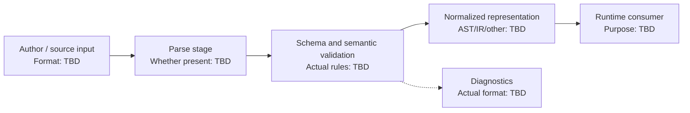

# KaizenLang DSL - Interview Deep Dive

> **Evidence boundary:** The supplied resume profile names “KaizenLang DSL” only. No actual grammar, schema, execution model, user, architecture, contribution, or result was supplied. The TypeScript below is a generic schema-validation teaching example, **not the actual KaizenLang syntax or implementation**. Replace unknowns only with verified project facts.

## Definition

KaizenLang is a named resume project described as a DSL. Its purpose, users, and relationship to the surrounding system are **> TODO: verify**.

## STAR story (behavioral-story template)

### Situation

> TODO: verify — product context, user need, and why a DSL was chosen or needed.

### Task

> TODO: verify — your responsibility and intended outcome.

### Action

> TODO: verify — actual grammar/schema design, validation, runtime integration, testing, and collaboration you performed.

### Result

> TODO: verify — verified result, evidence, and attribution.

## Requirements (system-design-case template)

### Functional requirements

- > TODO: verify — actual constructs, entities, authoring flow, validation, and execution behavior.

### Non-functional requirements

- > TODO: verify — safety, expressiveness, compatibility, error clarity, performance, and versioning constraints that applied.

## How it works

> TODO: verify — explain the real path from authored input through parsing, schema validation, normalization/AST construction (if used), execution/rendering, and error reporting. Do not claim the project used a parser, AST, JSON schema, or a specific grammar until confirmed.

## Estimation

- DSL documents/configurations and usage volume: > TODO: verify
- Input size, validation frequency, or runtime limits: > TODO: verify
- Assumptions and evidence: > TODO: verify

## API design

- Actual parser/validator/runtime interface: > TODO: verify
- Compatibility/versioning contract: > TODO: verify (or state not applicable)

## Data model

- Actual grammar, schema, AST or intermediate representation: > TODO: verify
- Unknown-field, type, and version handling: > TODO: verify

## High-level architecture

The diagram shows a generic DSL processing pipeline solely as a discussion aid. Replace or remove stages to match verified implementation details.



## Working code example

This runnable TypeScript example validates a deliberately small, generic JSON UI-node schema. It demonstrates an allow-listed discriminant and object props. It does **not** specify KaizenLang's real syntax, schema, or behavior.

```ts
type UiNode = {
  kind: "text" | "button";
  props: Record<string, string>;
};

function isRecord(value: unknown): value is Record<string, unknown> {
  return typeof value === "object" && value !== null && !Array.isArray(value);
}

function parseUiNode(input: unknown): UiNode | null {
  if (!isRecord(input) || !isRecord(input.props)) return null;
  if (input.kind !== "text" && input.kind !== "button") return null;

  const props: Record<string, string> = {};
  for (const [key, value] of Object.entries(input.props)) {
    if (typeof value !== "string") return null;
    props[key] = value;
  }

  return { kind: input.kind, props };
}

const parsed = parseUiNode({ kind: "button", props: { label: "Save" } });
console.log(parsed?.kind ?? "invalid");
```

Expected output: `button`.

Complexity: for $p$ properties in the input node, validation takes $O(p)$ time and $O(p)$ additional space for the copied props. This example omits the real DSL's unknown constraints, which remain **> TODO: verify**.

## Deep dives

### Schema and language design

- Actual syntax/grammar and why it was selected: > TODO: verify
- Type system, schema constraints, and semantic checks: > TODO: verify
- Error messages, source locations, and recovery behavior: > TODO: verify

### Runtime and integration

- Actual consumer and generated/executed result: > TODO: verify
- Security boundary, allowed operations, and resource limits: > TODO: verify
- Version compatibility and migration plan: > TODO: verify

### Alternatives considered and rejected

| Alternative | Why considered | Why rejected / evidence |
| --- | --- | --- |
| > TODO: verify | > TODO: verify | > TODO: verify |
| > TODO: verify | > TODO: verify | > TODO: verify |

### Bottlenecks and trade-offs

- Expressiveness vs safety: actual decision and evidence > TODO: verify
- Runtime or validation bottleneck: > TODO: verify
- Compatibility/maintenance trade-off: > TODO: verify

There is no single Big-O complexity for a DSL project. Describe the complexity of actual parsing/validation/runtime operations only if measured or derived from the verified implementation. Project-specific performance and trade-offs: > TODO: verify.

## Metrics and evidence

The supplied profile lists `60%`, `45%`, `85%`, `4x`, `300+ tests`, and `120+ users` without project mapping.

- Metric associated with KaizenLang: > TODO: verify
- **How I measured this: (fill in)**
- Baseline, formula/definition, timeframe, source, attribution, and limitations: > TODO: verify

## Common mistakes

- Presenting the illustrative TypeScript schema as the actual KaizenLang grammar.
- Saying “DSL” without explaining the concrete domain and why a general-purpose language/configuration was insufficient.
- Treating syntactic validation as semantic validation or as a security boundary.
- Omitting diagnostics, versioning, compatibility, or resource limits when they applied.
- Quoting adoption/performance metrics without a source and measurement definition.

## Interview questions and model-answer scaffolds

Fill in bracketed items from verified evidence; do not infer the real language design from the teaching example above.

1. **What problem did KaizenLang solve?** — “It enabled **[verified user/task]** by expressing **[verified domain operation]**; the evidence for the need was **[source]**.”
2. **Why build a DSL rather than use JSON/configuration or a general-purpose language?** — “We considered **[real alternatives]**; the chosen approach addressed **[verified constraint]** with trade-off **[evidence]**.”
3. **What did the actual syntax look like?** — “A real example was **[approved, non-sensitive snippet]**; its constructs mean **[verified explanation]**.”
4. **How was input parsed and validated?** — “The actual stages were **[verified stages]**; invalid input produced **[actual diagnostics]**.”
5. **How did you represent the parsed program?** — “The implementation used **[verified representation or none]** because **[reason]**.”
6. **How did you prevent invalid or unsafe operations?** — “The system restricted **[verified capability]** at **[actual enforcement boundary]** and tested it with **[evidence]**.”
7. **How did schema or language versions evolve?** — “Compatibility was handled by **[verified policy]**; the migration example was **[evidence]**.”
8. **What was the hardest design trade-off?** — “The trade-off was **[verified tension]**; we chose **[decision]** because **[evidence]**.”
9. **How did you test the DSL?** — “We used **[actual unit/property/integration tests]** for **[verified cases]**; results were **[source]**.”
10. **What outcome can you defend?** — “The verified result is **[metric/outcome]**. **How I measured this: (fill in)**; baseline and source: **[fill in]**.”

## Follow-up questions

Prepare a real syntax example, schema/version policy, invalid-input example, security boundary, test evidence, and alternatives considered. Until supplied, each remains `> TODO: verify`.

## Related notes

- [Resume deep-dive index](README.md)
- [RAG](../09-agentic-ai/rag.md)
- [Tool calling](../09-agentic-ai/tool-calling.md)
- [System design case template](../templates/system-design-case.md)
