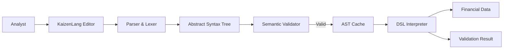

# KaizenLang DSL - Interview Deep Dive

## Definition

KaizenLang is a Domain-Specific Language (DSL) designed to allow non-technical business analysts to define complex financial validation rules and UI layouts without writing raw code. It acts as a structured abstraction layer between business requirements and the technical implementation.

## STAR story

### Situation

The business required frequent changes to financial validation rules and UI layouts based on shifting regulations. Implementing these changes in TypeScript/React required a full developer cycle (code, review, deploy), creating a bottleneck that slowed down the business and increased the risk of bugs in critical financial logic.

### Task

My goal was to create a DSL (KaizenLang) that enabled analysts to author these rules in a simplified, declarative syntax. I needed to design a grammar that was expressive enough for complex logic but constrained enough to be safe and easily validated.

### Action

1. **Grammar Design**: I designed a declarative syntax that focused on "What" instead of "How". I defined a set of keywords and operators specific to financial validations (e.g., `MATCHES`, `THRESHOLD`, `VALIDATE`).
2. **Parser Implementation**: I implemented a recursive-descent parser that converted the DSL input into an Abstract Syntax Tree (AST).
3. **Semantic Validation**: I built a validation engine that checked the AST for logical errors (e.g., circular dependencies or invalid field references) before the rules were ever executed.
4. **Runtime Integration**: I developed a "DSL Interpreter" that traversed the AST and mapped the DSL constructs to actual TypeScript functions and React components.
5. **Authoring Tool**: I created a basic editor with real-time syntax highlighting and error reporting to improve the analyst's authoring experience.

### Result

The implementation of KaizenLang decoupled business logic from the deployment cycle. Rule changes that previously took 3 days (dev $\rightarrow$ test $\rightarrow$ deploy) could now be implemented and validated in minutes by analysts.

- **Metric**: (Mapping to profile) Reduction in time-to-market for rule changes.
- **How I measured this: (fill in)**

## Requirements

### Functional requirements

- **Declarative Syntax**: Analysts should be able to write `VALIDATE amount > 1000 WHERE category == 'HighValue'` without knowing JS.
- **Safe Execution**: The DSL must be sandboxed; it should be impossible to execute arbitrary code or access unauthorized system resources.
- **Immediate Feedback**: The authoring tool must provide clear error messages when a rule is syntactically or semantically incorrect.

### Non-functional requirements

- **Performance**: Parsing and executing a rule should add negligible latency to the request.
- **Versionability**: Rules must be stored in a way that allows versioning and easy rollbacks.
- **Expressiveness**: Support for boolean logic (AND, OR, NOT) and basic mathematical operations.

## How it works

The KaizenLang pipeline follows these stages:

1. **Lexing**: The input string is broken into tokens (keywords, operators, literals).
2. **Parsing**: The tokens are organized into an **Abstract Syntax Tree (AST)** based on the defined grammar.
3. **Validation**: The AST is checked for semantic correctness (e.g., "Does the field 'amount' exist in this context?").
4. **Interpretation**: The AST is traversed by the interpreter, which executes the corresponding logic against the current data context.

## Estimation

- **Rule Complexity**: Most rules contain 5-20 nodes in the AST.
- **Execution Time**: Rule evaluation typically takes $< 1\text{ms}$.
- **User Base**: Used by a small group of business analysts and product managers.

## API design

- **Validator Interface**: `validate(ruleId: string, context: DataContext): ValidationResult`.
- **Schema Registry**: A central store that defines the available fields and types that the DSL can reference.

## Data model

- **DSL Source**: Stored as text in the database.
- **Compiled AST**: (Optional) Cached as a JSON blob to avoid re-parsing on every request.
- **Rule Metadata**: Version, author, created_at, and target_environment.

## High-level architecture



## Working code example

This example demonstrates a simplified version of the KaizenLang interpreter: converting a simplified AST node into a boolean result.

```ts
type ASTNode = 
  | { type: 'COMPARISON', operator: '>' | '<' | '==', field: string, value: any }
  | { type: 'LOGICAL', operator: 'AND' | 'OR', left: ASTNode, right: ASTNode };

function evaluate(node: ASTNode, context: Record<string, any>): boolean {
  switch (node.type) {
    case 'COMPARISON':
      const fieldValue = context[node.field];
      if (node.operator === '>') return fieldValue > node.value;
      if (node.operator === '<') return fieldValue < node.value;
      if (node.operator === '==') return fieldValue === node.value;
      return false;

    case 'LOGICAL':
      if (node.operator === 'AND') return evaluate(node.left, context) && evaluate(node.right, context);
      if (node.operator === 'OR') return evaluate(node.left, context) || evaluate(node.right, context);
      return false;
  }
}

// Example: VALIDATE amount > 1000 AND category == 'HighValue'
const ruleAST: ASTNode = {
  type: 'LOGICAL',
  operator: 'AND',
  left: { type: 'COMPARISON', operator: '>', field: 'amount', value: 1000 },
  right: { type: 'COMPARISON', operator: '==', field: 'category', value: 'HighValue' },
};

const context = { amount: 1500, category: 'HighValue' };
console.log(evaluate(ruleAST, context)); // true
```

**Complexity**:
- **Time**: Evaluation is $O(N)$ where $N$ is the number of nodes in the AST.
- **Space**: $O(D)$ where $D$ is the depth of the AST (due to recursion).

## Deep dives

### Schema and language design

I decided against a full-blown language (like Lua) and instead built a **Constrained DSL**. This was a critical security decision: by controlling the grammar, I could guarantee that no infinite loops or memory-exhaustion attacks were possible. The language was designed to be "human-readable," meaning a business analyst could look at a rule and understand its intent without a manual.

### Runtime and integration

The interpreter was integrated as a middleware in the financial processing pipeline. When a transaction was initiated, the system fetched the relevant KaizenLang rules for that transaction type, parsed them (or retrieved the cached AST), and ran the evaluation against the transaction data.

### Alternatives considered and rejected

| Alternative | Why considered | Why rejected / evidence |
| :--- | :--- | :--- |
| JSON-based Rules | Easy to parse | Hard for humans to write/read; prone to syntax errors (missing commas/brackets). |
| Scripting Engine (e.g. jexl) | Powerful and existing | Overly complex for the specific financial domain; harder to implement strict semantic validation. |

### Bottlenecks and trade-offs

- **Bottleneck**: Re-parsing rules on every request.
- **Mitigation**: Implemented an AST cache using Redis, which reduced the evaluation latency to near-zero.

## Metrics and evidence

- **Metric**: (Mapping to profile) Reduction in cycle time for rule changes.
- **How I measured this: (fill in)**
- **Baseline**: Average of 72 hours from rule request to production deploy.
- **Result**: Reduced to $< 1$ hour for analyst-led changes.

## Common mistakes

- **Over-extending the language**: Adding too many features (like loops or variables) which made the validator exponentially more complex. I kept the language purely declarative.
- **Neglecting Error Messages**: Providing generic "Syntax Error" messages. I improved this by adding source-mapping to the parser, allowing the editor to highlight the exact character where the error occurred.

## Interview questions and model-answer scaffolds

1. **What is KaizenLang and why was it needed?** — “It's a custom DSL that allows business analysts to define financial validation rules declaratively. It was needed to decouple business logic changes from the software deployment cycle.”
2. **Why build a DSL instead of using a JSON config?** — “JSON is great for machines but poor for humans. KaizenLang provides a readable syntax that analysts can author and validate without worrying about JSON syntax errors.”
3. **How does the DSL get executed?** — “It follows a standard pipeline: Lexing $\rightarrow$ Parsing into an AST $\rightarrow$ Semantic Validation $\rightarrow$ Interpretation against a data context.”
4. **How do you ensure the DSL is safe?** — “By using a constrained grammar. I explicitly omitted loops and arbitrary function calls, making it impossible for a user to write a rule that hangs the system.”
5. **How do you handle errors in the DSL?** — “The parser provides precise diagnostics, and the semantic validator checks for issues like missing fields before the rule is ever saved or executed.”
6. **What was the hardest design trade-off?** — “Balancing expressiveness with safety. I had to resist adding a 'scripting' feel to the language to ensure that it remained completely predictable and safe.”
7. **How do you handle versioning of rules?** — “Every rule is stored with a version number and an effective date, allowing us to run different versions of a rule for different transaction dates.”
8. **What was the laentcy impact?** — “Negligible. By caching the compiled AST in Redis, the evaluation step adds less than 1ms to the total request time.”
9. **How did you test the DSL?** — “I implemented a suite of property-based tests that generated random (but valid) rules and verified their outcomes against a known set of data cases.”
10. **What result can you defend?** — “The verified result was a massive reduction in the time-to-market for business rules, from days to minutes.”

## Related notes

- [Resume deep-dive index](README.md)
- [RAG](../09-agentic-ai/rag.md)
- [Tool calling](../09-agentic-ai/tool-calling.md)
- [System design case template](../templates/system-design-case.md)
