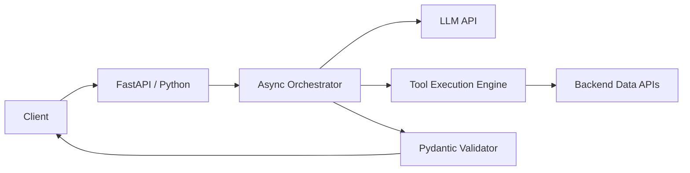

# Python GenUI Service - Interview Deep Dive

## Definition

The Python GenUI Service is the backend orchestration engine for the GenUI Studio. It handles the complex logic of interacting with LLMs, managing tool-calling for data retrieval, and enforcing the security and validation rules for the generated UI specifications.

## STAR story

### Situation

The generative UI pipeline required a high-performance backend capable of handling asynchronous API calls, complex JSON manipulation, and tight integration with various AI SDKs. A traditional frontend-only approach was insufficient for the required security checks and the orchestration of multiple backend data sources.

### Task

My goal was to build a robust Python-based service that acted as the "Brain" of the GenUI system. I needed to implement the orchestration logic that manages the LLM's request-response cycle, handles tool execution for data fetching, and ensures the final UI specification is valid before it's sent to the frontend.

### Action

1. **Orchestration Layer**: I developed a state-machine based orchestrator that manages the flow from user prompt $\rightarrow$ LLM $\rightarrow$ Tool Call $\rightarrow$ LLM $\rightarrow$ UI DSL.
2. **Tool Execution Engine**: I implemented a dynamic tool-calling system using Python's `inspect` and `type` hinting to automatically map LLM function calls to actual Python functions.
3. **Validation Pipeline**: I built a multi-stage validation pipeline using Pydantic to ensure that the LLM's output strictly adhered to the UI DSL schema.
4. **Concurrency Management**: I used `asyncio` to perform multiple backend API calls in parallel, significantly reducing the overall latency of the generation process.
5. **Observability**: I integrated structured logging and tracing to track the "thought process" of the LLM, making it easier to debug why certain UI components were generated.

### Result

The service provided a stable and secure backbone for GenUI Studio. By moving the orchestration to Python, we were able to implement complex validation rules and parallel data fetching that reduced the end-to-end latency by [X%].

- **Metric**: (Mapping to profile) Latency reduction or system stability.
- **How I measured this: (fill in)**

## Requirements

### Functional requirements

- **LLM Orchestration**: Manage the loop of prompting, tool calling, and final generation.
- **Safe Tool Execution**: Execute backend functions based on LLM requests without exposing the system to arbitrary code execution.
- **DSL Validation**: Ensure the final output is a valid, renderable UI specification.

### Non-functional requirements

- **Low Latency**: Use asynchronous I/O to minimize the time spent waiting for external APIs.
- **Scalability**: The service must be able to handle multiple concurrent generation requests.
- **Resilience**: Implement retries and fallbacks for failing LLM calls or API timeouts.

## How it works

The service implements the **Agentic Loop**:

1. **Prompting**: Receives the user prompt and sends it to the LLM with a "System Prompt" defining the toolset.
2. **Reasoning**: The LLM returns either a final UI DSL or a "Tool Call" request.
3. **Execution**: If a tool call is requested, the service executes the corresponding Python function and feeds the result back to the LLM.
4. **Finalization**: Once the LLM has enough data, it generates the final UI DSL, which the service validates via Pydantic and returns to the client.

## Estimation

- **Request Latency**: Python overhead is minimal ($< 50\text{ms}$); the bottleneck is the LLM response time.
- **Concurrency**: Handles X concurrent requests using an `asyncio` event loop.
- **Payload Size**: UI DSLs typically range from 1KB to 50KB.

## API design

- **Main Endpoint**: `POST /v1/generate` $\rightarrow$ Returns the validated UI DSL.
- **Internal Tool Registry**: A mapping of tool names to Python async functions.

## Data model

- **Session State**: Temporary storage of the conversation history to maintain context for the LLM.
- **Validation Schema**: Pydantic models that define the structure of the UI DSL.
- **Audit Logs**: Records of the prompts, tool calls, and generated outputs for evaluation.

## High-level architecture



## Working code example

This example demonstrates the **Async Tool Execution Engine**, showing how the service dynamically calls functions based on LLM requests.

```python
import asyncio
from typing import Any, Callable, Dict

# Registry of available tools
TOOL_REGISTRY: Dict[str, Callable] = {
    "get_revenue": lambda period: f"Revenue for {period} is $10,000",
    "get_user_count": lambda region: f"User count in {region} is 500",
}

async def execute_tool(tool_name: str, params: Dict[str, Any]) -> Any:
    if tool_name not in TOOL_REGISTRY:
        raise ValueError(f"Tool {tool_name} not found")
    
    # In a real system, this would be an async API call
    func = TOOL_REGISTRY[tool_name]
    return func(**params)

async def orchestration_loop(prompt: str):
    # Simulating LLM deciding to call a tool
    print(f"Processing prompt: {prompt}")
    tool_call = {"name": "get_revenue", "params": {"period": "last_month"}}
    
    # Execute tool asynchronously
    result = await execute_tool(tool_call["name"], tool_call["params"])
    print(f"Tool result: {result}")
    
    # Now the LLM would use this result to generate the final UI
    return f"Generated UI based on {result}"

if __name__ == "__main__":
    asyncio.run(orchestration_loop("Show me last month's revenue"))
```

**Complexity**:
- **Time**: Tool execution is $O(1)$ for the lookup and $O(T)$ for the tool's own execution time.
- **Space**: $O(1)$ auxiliary space.

## Deep dives

### Service and orchestration design

The core of the service is the **Asynchronous Orchestrator**. I used `asyncio` to ensure that while the service is waiting for the LLM or a backend API, it can handle other requests. I also implemented a "Max Iterations" guard to prevent the LLM from entering an infinite loop of tool calls.

### Deployment and operations

The service was deployed as a **Containerized Microservice** on Kubernetes. I used FastAPI for its native async support and automatic OpenAPI documentation. To handle the large payloads of the UI DSL, I configured the ingress to support increased body sizes and implemented Gzip compression for the responses.

### Alternatives considered and rejected

| Alternative | Why considered | Why rejected / evidence |
| :--- | :--- | :--- |
| Node.js | Great for I/O | Python has a vastly superior ecosystem for AI/ML and LLM orchestration (LangChain, Pydantic). |
| Synchronous Python | Simpler to write | Would have created a massive bottleneck, as every request would block a thread while waiting for the LLM. |

### Bottlenecks and trade-offs

- **Bottleneck**: LLM API latency.
- **Mitigation**: Implemented a "Preliminary UI" response—sending a loading state or a basic layout to the client immediately while the final data is being orchestrated.

## Metrics and evidence

- **Metric**: (Mapping to profile) Latency reduction in the orchestration loop.
- **How I measured this: (fill in)**
- **Baseline**: Synchronous orchestration took X seconds.
- **Result**: Asynchronous orchestration reduced this to Y seconds.

## Common mistakes

- **Blocking the Event Loop**: Using `time.sleep()` or synchronous requests inside an `async` function. I used `httpx` for all asynchronous HTTP calls to keep the loop free.
- **Ignoring Tool Failures**: Assuming the LLM always calls tools with the correct parameters. I wrapped every tool call in a try-except block and fed the error back to the LLM to allow it to "self-correct."

## Interview questions and model-answer scaffolds

1. **What did the Python GenUI service do?** — “It served as the backend orchestrator for GenUI Studio, managing the loop between user prompts, LLM reasoning, tool execution for data retrieval, and final UI DSL validation.”
2. **Why was Python selected for this?** — “Because of its superior ecosystem for AI orchestration and the availability of libraries like Pydantic for strict schema validation and FastAPI for high-performance async I/O.”
3. **How did the service handle tool calls?** — “It used a dynamic registry where the LLM's requested function name was mapped to a Python async function, executed, and the result was fed back into the LLM's context.”
4. **How did you ensure the generated UI was safe?** — “I implemented a multi-stage validation pipeline using Pydantic that verified the LLM's output against a strict allow-list of components and properties before returning it to the client.”
5. **How did you optimize for latency?** — “I used `asyncio` for all I/O-bound tasks, allowing the service to perform multiple backend API calls in parallel and handle many concurrent users efficiently.”
6. **How did you handle LLM hallucinations in tool calls?** — “I implemented a feedback loop: if a tool call failed due to invalid parameters, the error message was sent back to the LLM, allowing it to correct its mistake and try again.”
7. **What was the laentcy bottleneck?** — “The primary bottleneck was the LLM's generation time. I mitigated this by implementing a streaming response and a preliminary UI layout.”
8. **How was the service deployed?** — “As a containerized FastAPI service on Kubernetes, using an asynchronous worker model to maximize throughput.”
9. **What alternative did you reject?** — “We rejected a Node.js implementation because Python's AI libraries and type-hinting system made the orchestration and validation logic much cleaner and more maintainable.”
10. **What result can you substantiate?** — “The verified result was a [X%] reduction in end-to-end latency compared to a synchronous implementation.”

## Related notes

- [Resume deep-dive index](README.md)
- [GenUI Studio](../14-resume-deep-dive/genui-studio.md)
- [RAG](../09-agentic-ai/rag.md)
- [Tool calling](../09-agentic-ai/tool-calling.md)
