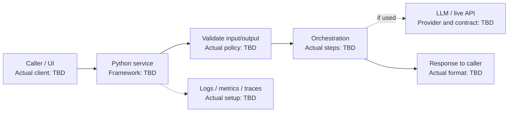

# Python GenUI Service - Interview Deep Dive

> **Evidence boundary:** The supplied profile names a “Python GenUI service” and separately lists Python and Streamlit, plus agentic AI/generative UI exposure. It does not establish that Streamlit was used in this service or describe its framework, API, deployment, ownership, or outcomes. Verify project-specific facts before claiming them.

## Definition

Python GenUI service is a named resume project. Its exact service boundary and responsibilities are **> TODO: verify**.

## STAR story (behavioral-story template)

### Situation

> TODO: verify — product need, callers/users, existing workflow, and constraints.

### Task

> TODO: verify — your own responsibilities and intended service outcome.

### Action

> TODO: verify — actual Python service, validation, orchestration, deployment, testing, and collaboration work you performed.

### Result

> TODO: verify — verified service/project result, attribution, and evidence source.

## Requirements (system-design-case template)

### Functional requirements

- > TODO: verify — actual endpoints, inputs/outputs, generation workflow, and downstream integrations.

### Non-functional requirements

- > TODO: verify — latency, reliability, security, privacy, concurrency, resource limits, and operational requirements.

## How it works

> TODO: verify — describe the real request lifecycle: input validation, orchestration, model/API calls if applicable, response validation, rendering/consumer, error handling, and observability. Do not assume FastAPI, Flask, Streamlit, a queue, or a particular model provider.

## Estimation

- Request volume/concurrency/payload sizes: > TODO: verify
- Latency/resource budget and how established: > TODO: verify

## API design

- Actual route/function contract, request/response schema, and errors: > TODO: verify
- Authentication, authorization, rate limits, and retries: > TODO: verify (or mark not applicable with evidence)

## Data model

- Actual request, response, generated schema, persistence, and retention: > TODO: verify
- Secrets and user data handling: > TODO: verify

## High-level architecture

Generic service flow only. The framework, model/API calls, deployment, and persistence are not known from the supplied profile and must be verified.



## Working code example

The following runnable Python 3.9+ example validates a small allow-listed component payload. It is a self-contained teaching example, **not code from the resume project**, and is not a complete JSON Schema validator or API service.

```python
from typing import Any

ALLOWED_COMPONENTS = {"Text", "Button"}


def validate_component(payload: Any) -> dict[str, Any]:
    if not isinstance(payload, dict):
        raise ValueError("payload must be an object")

    component = payload.get("component")
    props = payload.get("props")
    if not isinstance(component, str) or component not in ALLOWED_COMPONENTS:
        raise ValueError("unsupported component")
    if not isinstance(props, dict) or not all(isinstance(key, str) for key in props):
        raise ValueError("props must be an object with string keys")

    return {"component": component, "props": props}


if __name__ == "__main__":
    print(validate_component({"component": "Button", "props": {"label": "Save"}}))
```

Expected output: `{'component': 'Button', 'props': {'label': 'Save'}}`.

Complexity: for $p$ properties, validation takes $O(p)$ time and $O(1)$ additional space excluding the returned dictionary; the returned copy is $O(p)$. Production behavior must also validate allowed prop names/types and enforce authorization/resource limits.

## Deep dives

### Service and orchestration design

- Actual Python framework, process model, and service boundary: > TODO: verify
- Actual external API/model calls and request budgets: > TODO: verify
- Timeout, retry, cancellation, and partial-failure behavior: > TODO: verify

### Deployment and operations

- Actual runtime/deployment target and configuration: > TODO: verify
- Health checks, logs/metrics/traces, alerting, and incident handling: > TODO: verify
- Secrets, privacy, and retention controls: > TODO: verify

### Alternatives considered and rejected

| Alternative | Why considered | Why rejected / evidence |
| --- | --- | --- |
| > TODO: verify | > TODO: verify | > TODO: verify |
| > TODO: verify | > TODO: verify | > TODO: verify |

### Bottlenecks and trade-offs

- Latency/cost/resource bottleneck: > TODO: verify
- Validation and safety vs flexibility: > TODO: verify
- Operational complexity vs deployment choice: > TODO: verify

There is no single Big-O complexity for the complete network service. Explain verified request-processing costs separately from network/model latency and resource limits. Project trade-offs: > TODO: verify.

## Metrics and evidence

The profile lists `60%`, `45%`, `85%`, `4x`, `300+ tests`, and `120+ users` without assigning them to this project.

- Metric associated with this service: > TODO: verify
- **How I measured this: (fill in)**
- Baseline, definition/formula, period, source, attribution, and limitations: > TODO: verify

## Common mistakes

- Claiming Streamlit or a specific Python framework was used based only on its presence in the profile.
- Describing model/API behavior without identifying the actual request contract and failure handling.
- Treating basic shape validation as complete schema validation or security enforcement.
- Omitting timeout, privacy, secrets, concurrency, or resource-limit decisions where relevant.
- Quoting a performance or user metric without a baseline and reproducible source.

## Interview questions and model-answer scaffolds

Fill bracketed items only with verified facts.

1. **What did the Python GenUI service do?** — “It provided **[verified capability]** to **[verified caller/user]** through **[actual interface]**.”
2. **Why was Python selected?** — “The verified constraints were **[facts]**; the team chose Python over **[actual alternatives]** because **[reason]**.”
3. **What was the service contract?** — “The request contained **[actual fields]** and returned **[actual response]**; invalid input produced **[actual behavior]**.”
4. **How did the service validate generated output?** — “It enforced **[verified schema/rules]** at **[actual boundary]** and handled invalid output by **[actual recovery]**.”
5. **What external APIs or model calls were involved?** — “The service called **[verified systems]** for **[purpose]**, with **[actual permissions/data limits]**.”
6. **How did it handle slow or failing dependencies?** — “The observed failure modes were **[facts]**; the service used **[actual timeout/retry/fallback]**.”
7. **How was the service deployed and monitored?** — “It ran on **[verified target]**; operations used **[actual health/telemetry]**.”
8. **What alternatives did you reject?** — “We considered **[real option]** and selected **[actual choice]** based on **[evidence/trade-off]**.”
9. **How did you test it?** — “We tested **[verified behaviors]** using **[actual tests]**; evidence was **[source/result]**.”
10. **What outcome can you substantiate?** — “The verified outcome is **[metric/result]**. **How I measured this: (fill in)**; baseline/source: **[fill in]**.”

## Follow-up questions

Prepare a real endpoint or call path, sanitized payload example, dependency failure case, test evidence, deployment story, and metric source. Unknowns remain `> TODO: verify`.

## Related notes

- [Resume deep-dive index](README.md)
- [GenUI Studio](genui-studio.md)
- [RAG](../09-agentic-ai/rag.md)
- [Tool calling](../09-agentic-ai/tool-calling.md)
