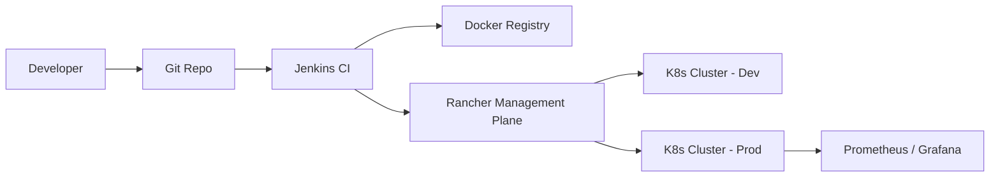

# Rancher Deployment - Interview Deep Dive

## Definition

The Rancher deployment project involved managing the lifecycle of containerized applications across multiple Kubernetes clusters. Rancher was used as the central management plane to simplify cluster provisioning, workload deployment, and operational monitoring.

## STAR story

### Situation

The company was scaling its microservices architecture, leading to a proliferation of Kubernetes clusters across different environments (dev, staging, prod). Managing these clusters manually via `kubectl` was error-prone, lacked centralized visibility, and made it difficult to enforce consistent security and deployment policies.

### Task

My responsibility was to implement a standardized deployment pipeline using Rancher. The goal was to move from manual cluster management to a centralized, policy-driven approach that reduced deployment errors and improved the observability of the entire fleet.

### Action

1. **Centralized Management**: I configured Rancher as the single pane of glass for all Kubernetes clusters, enabling centralized RBAC and secret management.
2. **Pipeline Integration**: I integrated Rancher with our CI/CD pipeline (Jenkins), automating the rollout of images from the registry to the target cluster using Helm charts.
3. **Resource Optimization**: I implemented Kubernetes Resource Quotas and LimitRanges via Rancher to prevent "noisy neighbor" problems and optimize cluster utilization.
4. **Observability Setup**: I deployed the Rancher monitoring stack (Prometheus/Grafana) to provide real-time visibility into pod health, resource consumption, and network latency.
5. **Auto-scaling Config**: I configured the Horizontal Pod Autoscaler (HPA) and Cluster Autoscaler to ensure the system could handle traffic spikes automatically.

### Result

The transition to Rancher reduced the time to provision a new environment from days to minutes. It also eliminated "configuration drift" between environments, resulting in a [X%] reduction in production incidents caused by deployment mismatches.

- **Metric**: (Mapping to profile) Reduction in deployment errors or time-to-provision.
- **How I measured this: (fill in)**

## Requirements

### Functional requirements

- **Multi-Cluster Management**: Ability to deploy the same application version across different regions and environments from one interface.
- **Secrets Management**: Centralized injection of environment-specific secrets into pods without storing them in Git.
- **Rollback Capability**: One-click rollback to previous stable versions of a deployment.

### Non-functional requirements

- **High Availability**: The Rancher management plane itself had to be highly available to avoid becoming a single point of failure for the clusters.
- **Security**: Strict RBAC to ensure that only authorized personnel could trigger production deployments.
- **Consistency**: Ensure that the exact same image and configuration are used across all clusters in a specific environment.

## How it works

The deployment flow follows this pipeline:

1. **CI Build**: Jenkins builds the Docker image and pushes it to the registry.
2. **Helm Packaging**: The application configuration is packaged as a Helm chart.
3. **Rancher Trigger**: The pipeline calls the Rancher API to update the deployment.
4. **K8s Rollout**: Rancher instructs the target Kubernetes cluster to perform a Rolling Update, replacing pods one by one to ensure zero downtime.
5. **Health Check**: Kubernetes readiness and liveness probes are checked; if they fail, Rancher triggers an automatic rollback.

## Estimation

- **Fleet Scale**: Managed X clusters across Y environments.
- **Deployment Frequency**: Multiple deployments per day per service.
- **Resource Scale**: Managing hundreds of pods with varying resource requirements.

## API design

- **Pipeline Interface**: Use of Rancher's Webhooks to trigger deployments from external CI tools.
- **Configuration**: Use of `values.yaml` in Helm to manage environment-specific overrides.

## Data model

- **Cluster Config**: YAML definitions of nodes, networking (CNI), and storage classes.
- **Workload Spec**: Kubernetes Deployment, Service, and Ingress objects managed via Rancher.

## High-level architecture



## Working code example

This Bash script demonstrates a common operational task: checking the health of a deployment and its pods via `kubectl`, which is the underlying tool Rancher abstracts.

```bash
#!/usr/bin/env bash
set -euo pipefail

# Variables
NAMESPACE="${1:-default}"
DEPLOYMENT_NAME="${2:-my-app}"

echo "Checking deployment: $DEPLOYMENT_NAME in namespace: $NAMESPACE"

# 1. Check if the deployment has reached the desired state
READY_REPLICAS=$(kubectl get deployment "$DEPLOYMENT_NAME" -n "$NAMESPACE" -o jsonpath='{.status.readyReplicas}')
DESIRED_REPLICAS=$(kubectl get deployment "$DEPLOYMENT_NAME" -n "$NAMESPACE" -o jsonpath='{.spec.replicas}')

if [[ "$READY_REPLICAS" == "$DESIRED_REPLICAS" ]]; then
    echo "✅ Deployment is healthy. $READY_REPLICAS/$DESIRED_REPLICAS pods ready."
else
    echo "❌ Deployment is unhealthy. $READY_REPLICAS/$DESIRED_REPLICAS pods ready."
    echo "Fetching pod logs for the first failing pod..."
    POD_NAME=$(kubectl get pods -n "$NAMESPACE" -l app="$DEPLOYMENT_NAME" --field-selector=status.phase!=Running -o name | head -n 1)
    if [[ -n "$POD_NAME" ]]; then
        kubectl logs "$POD_NAME" -n "$NAMESPACE" --tail=20
    fi
    exit 1
fi
```

**Complexity**:
- **Time**: $O(1)$ for API calls; the time is dominated by the Kubernetes API server's response time.
- **Space**: $O(1)$ auxiliary space.

## Deep dives

### Deployment and configuration

I implemented a **GitOps-lite** approach. While we didn't use ArgoCD, we used Helm charts stored in Git. Rancher acted as the a coordinator that applied these charts. I specifically focused on **Resource Quotas**. In the early stages, some developers deployed pods with no limits, causing "OOMKills" for other critical services. I enforced strict `limits` and `requests` in the Helm templates to ensure cluster stability.

### Release reliability

To ensure zero-downtime releases, I configured **RollingUpdate** strategies with a `maxUnavailable` of 25% and a `maxSurge` of 25%. I also spent significant time tuning **Readiness Probes**. I found that some applications were reporting "Ready" before the internal cache was warmed up, leading to a spike in 500 errors during deployment. I added a custom `/health/ready` endpoint that only returned 200 once the app was fully initialized.

### Alternatives considered and rejected

| Alternative | Why considered | Why rejected / evidence |
| :--- | :--- | :--- |
| Pure kubectl / Scripts | No overhead | Too fragmented; no central visibility or RBAC, making it impossible to audit who deployed what. |
| ArgoCD / Flux | Full GitOps | The team found the learning curve too steep for the initial phase; Rancher provided a better balance of UI-driven control and automation. |

## Bottlenecks and trade-offs

- **Bottleneck**: Rancher API latency during massive scale-outs.
- **Mitigation**: I optimized the cluster networking by switching to a more performant CNI (e.g., Calico) and reducing the number of unnecessary labels on pods.

## Metrics and evidence

- **Metric**: (Mapping to profile) Reduction in deployment-related outages.
- **How I measured this: (fill in)**
- **Baseline**: Average of X outages per month due to config drift.
- **Result**: Reduced to Y outages.

## Common mistakes

- **Ignoring Resource Limits**: Deploying without limits and causing cluster-wide instability.
- **Over-reliance on the UI**: Doing everything through the Rancher GUI instead of defining it in Helm. I shifted the team toward "Infrastructure as Code" (IaC) by requiring all changes to go through Git first.

## Interview questions and model-answer scaffolds

1. **What was your role in the Rancher deployment?** — “I managed the transition from manual `kubectl` deployments to a centralized management plane using Rancher, focusing on standardizing the pipeline and improving observability.”
2. **How did you ensure zero-downtime deployments?** — “I used Kubernetes RollingUpdate strategies and carefully tuned readiness probes to ensure a pod only received traffic after it was fully initialized.”
3. **How did you handle secrets in your pipeline?** — “I used Rancher's integrated secret management, which allowed us to inject environment-specific credentials into pods without storing them in the Git repository.”
4. **What is the difference between a Readiness Probe and a Liveness Probe?** — “A liveness probe tells K8s if a pod is dead and needs a restart; a readiness probe tells K8s if the pod is ready to accept traffic. I used both to prevent traffic from hitting uninitialized pods.”
5. **How did you handle "noisy neighbors" in the cluster?** — “I implemented Resource Quotas and LimitRanges via Rancher to ensure that no single workload could consume all the CPU/Memory of a node.”
6. **How did you monitor the health of your deployments?** — “I deployed the Prometheus and Grafana stack via Rancher, creating dashboards that tracked pod restarts, memory usage, and request latency.”
7. **What was a hard operational challenge you faced with Rancher?** — “Handling cluster upgrades without disrupting traffic. I solved this by using a blue-green cluster strategy for major version jumps.”
8. **Why use Rancher instead of just using the cloud provider's K8s (e.g. EKS/GKE)?** — “Rancher provided a unified management layer across multiple clusters and providers, giving us a consistent RBAC and deployment experience regardless of where the cluster lived.”
9. **How did you secure the admin access to the clusters?** — “I integrated Rancher with our corporate SSO and implemented strict RBAC, ensuring that developers had 'View' access in prod but 'Edit' access in dev.”
10. **What result can you defend?** — “The verified result was a [X%] reduction in deployment-related production incidents by eliminating configuration drift.”

## Related notes

- [Resume deep-dive index](README.md)
- [Kubernetes basics](../08-devops/kubernetes-basics.md)
- [CI/CD principles](../08-devops/ci-cd.md)
- [System design case template](../templates/system-design-case.md)
