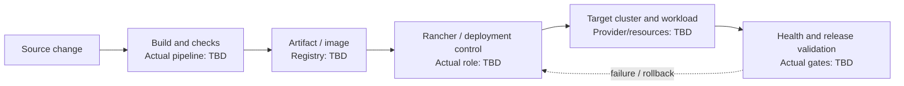

# Rancher Deployment - Interview Deep Dive

> **Evidence boundary:** The supplied profile names “Rancher/deployment” and lists Rancher among infrastructure skills. It does not specify Rancher version, cluster provider, deployment topology, workload, responsibility, or outcome. Verify all project details; the example commands and diagram below are generic, not evidence of what was done.

## Definition

Rancher deployment is a named resume bullet involving deployment and Rancher. The exact product responsibilities and deployment workflow are **> TODO: verify**.

## STAR story (behavioral-story template)

### Situation

> TODO: verify — service/workload, users, delivery context, and operational problem.

### Task

> TODO: verify — your responsibility for deployment, cluster operations, or release outcome.

### Action

> TODO: verify — actual Rancher/Kubernetes configuration, pipeline, release, monitoring, rollback, and collaboration steps.

### Result

> TODO: verify — substantiated deployment/operational outcome and evidence.

## Requirements (system-design-case template)

### Functional requirements

- > TODO: verify — what had to be deployed, exposed, configured, or operated.

### Non-functional requirements

- > TODO: verify — availability, security, resource, scaling, recovery, and rollout requirements that applied.

## How it works

> TODO: verify — explain the actual build-to-deployment chain, Rancher role, target cluster, workload resources, configuration/secrets, readiness/health gates, and rollback behavior. Do not infer a provider, Rancher product version, or Kubernetes topology.

## Estimation

- Clusters, workloads, replicas, or release frequency: > TODO: verify
- Resource/availability requirements and evidence: > TODO: verify

## API design

- Deployment interface, pipeline trigger, manifest/chart, or Rancher API actually used: > TODO: verify (or mark not applicable)

## Data model

- Kubernetes resources, configuration, secrets, and state actually managed: > TODO: verify

## High-level architecture

This generic delivery flow is a discussion aid only. Replace steps and labels with the verified project deployment process.



## Working code example

Read-only Bash status check for a Kubernetes deployment. It requires `kubectl` configured for the intended cluster and a valid namespace; it does not modify cluster state and is not a script from the resume project.

```bash
#!/usr/bin/env bash
set -euo pipefail

namespace="${NAMESPACE:-default}"

printf 'Context: '
kubectl config current-context
printf 'Deployments in namespace %s:\n' "$namespace"
kubectl get deployments -n "$namespace"
printf 'Pods in namespace %s:\n' "$namespace"
kubectl get pods -n "$namespace"
```

Complexity/trade-offs: the script makes a fixed number of API reads; cost depends on cluster/API response size rather than an algorithm over a local collection. Read-only checks are safe for inspection but do not prove application-level health or end-user behavior.

## Deep dives

### Deployment and configuration

- Actual container/image build and tag policy: > TODO: verify
- Actual manifests/Helm/configuration and environment separation: > TODO: verify
- Secret management and access controls: > TODO: verify

### Release reliability

- Actual readiness/liveness checks and rollout strategy: > TODO: verify
- Rollback procedure and incident evidence: > TODO: verify
- Monitoring/alerts used after release: > TODO: verify

### Alternatives considered and rejected

| Alternative | Why considered | Why rejected / evidence |
| --- | --- | --- |
| > TODO: verify | > TODO: verify | > TODO: verify |
| > TODO: verify | > TODO: verify | > TODO: verify |

### Bottlenecks and trade-offs

- Deployment bottleneck or failure mode: > TODO: verify
- How detected and mitigated: > TODO: verify
- Trade-off between release speed, safety, and operational complexity: > TODO: verify

There is no single Big-O complexity for a deployment platform. Explain verified operational trade-offs such as blast radius, upgrade cadence, access control, reliability, and maintenance. Project-specific evidence: > TODO: verify.

## Metrics and evidence

The supplied profile lists `60%`, `45%`, `85%`, `4x`, `300+ tests`, and `120+ users` without mapping them to this project.

- Metric associated with this deployment: > TODO: verify
- **How I measured this: (fill in)**
- Baseline, definition/formula, period, evidence source, attribution, and limitations: > TODO: verify

## Common mistakes

- Confusing Rancher with the workload cluster or claiming features not actually used.
- Describing a deployment diagram as the project's architecture before verifying it.
- Omitting image provenance, secret handling, readiness, rollback, or cluster access controls where relevant.
- Equating successful Kubernetes resource creation with a healthy end-user service.
- Claiming deployment-time improvements without a baseline, time period, and source.

## Interview questions and model-answer scaffolds

Replace placeholders with verified facts only.

1. **What was deployed, and what did Rancher do in that workflow?** — “We deployed **[verified workload]** to **[verified target]**; Rancher was used for **[actual purpose]**.”
2. **What did you personally own?** — “I owned **[specific deployment/operations work]** and partnered with **[verified team roles]**.”
3. **Walk through a release from commit to running workload.** — “The actual stages were **[verified pipeline]**, with gates at **[real checks]**.”
4. **How were configuration and secrets managed?** — “The deployed app received **[verified configuration]** through **[actual mechanism]**; access was controlled by **[evidence]**.”
5. **How did you know a deployment was healthy?** — “We checked **[actual readiness/health signals]** and validated **[application behavior]**.”
6. **How did you roll back a bad release?** — “The real rollback path was **[steps]**; the trigger/evidence was **[source]**.”
7. **What failure or operational challenge did you encounter?** — “The issue was **[verified event]**; I diagnosed it using **[signals]** and changed **[action]**.”
8. **Which alternative deployment strategy did you consider?** — “We considered **[real alternative]** and chose **[actual method]** because **[documented trade-off]**.”
9. **How did you secure cluster/deployment access?** — “The actual controls were **[verified RBAC/secrets/network controls]**; gaps/limitations were **[known]**.”
10. **What measurable result can you defend?** — “The verified result is **[metric/outcome]**. **How I measured this: (fill in)**; baseline and source: **[fill in]**.”

## Follow-up questions

Prepare the real cluster/provider topology, deployment manifest/pipeline, permissions, health gates, rollback, and measurement evidence. Any unknown remains `> TODO: verify`.

## Related notes

- [Resume deep-dive index](README.md)
- [Kubernetes basics](../08-devops/kubernetes-basics.md)
- [CI/CD principles](../08-devops/ci-cd.md)
- [System design case template](../templates/system-design-case.md)
