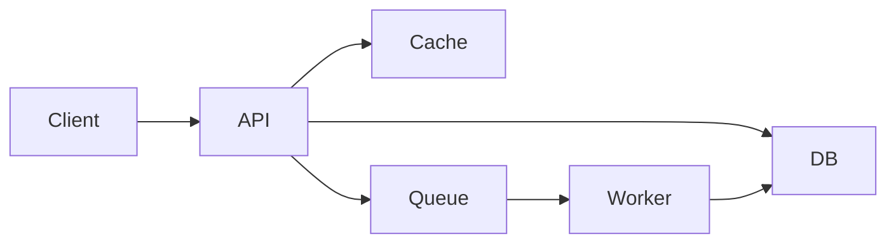

 System Design Case: <Name>

## Requirements

### Functional requirements

- Requirement 1
- Requirement 2
- Requirement 3

### Non-functional requirements

- Scalability: expected peak traffic
- Availability: expected uptime target
- Latency: p95 response time target
- Consistency: eventual vs strong consistency

## Estimation

- Users: X
- Requests per second: Y
- Data size: Z
- Peak traffic assumptions: explanation

## API design

### Endpoints

| Method | Path | Purpose |
| --- | --- | --- |
| GET | /resource | Retrieve item |
| POST | /resource | Create item |

## Data model

- Table or collection: key fields
- Primary key: id
- Indexes: recommended fields
- Important constraints: retention, validation, size

## High-level architecture

## Deep dives

### Storage

Describe choice of DB, sharding, partitioning, replication, or denormalization.

### Caching

Explain where caching helps, what should be cached, and invalidation rules.

### Queueing and async work

Describe when to decouple work and how to handle retries and idempotency.

## Bottlenecks and trade-offs

- Bottleneck 1: cause and mitigation
- Bottleneck 2: cause and mitigation
- Trade-off: consistency vs availability
- Trade-off: cost vs latency

## Follow-up questions

- How would you scale reads?
- What if the database becomes the bottleneck?
- How would you handle a regional outage?
- How do you monitor SLAs and failure modes?
