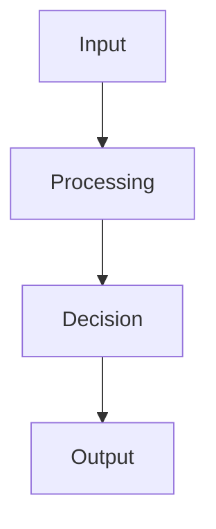

 Title

Tags: #tag1 #tag2
Difficulty: Easy / Medium / Hard
Status: Not started / Learning / Revised / Confident

## Definition

Write a concise definition in 1-3 lines. Keep it clear enough to memorize quickly.

## Why it matters / when to use

Explain the real-world value, common scenarios, and why interviewers care about it.

## How it works

Describe the mechanism or algorithm in plain English. Add a Mermaid diagram when it helps explain a flow or structure.



## Code example

```ts
// Example: implement the concept in TypeScript
function example(input: number[]): number {
  return input.reduce((sum, value) => sum + value, 0);
}

const values = [1, 2, 3, 4];
console.log(example(values)); // 10
```

## Time and space complexity / trade-offs

| Scenario | Time | Space | Notes |
| --- | --- | --- | --- |
| Best case | O(n) | O(1) | Example trade-off explanation |
| Average case | O(n) | O(1) | Typical interview expectation |
| Worst case | O(n) | O(1) | Important edge case |

## Common mistakes and pitfalls

- Pitfall 1: explanation
- Pitfall 2: explanation
- Pitfall 3: explanation

## Interview questions

### Q1: What is the core idea behind this concept?
Model answer: Explain the idea in one paragraph and include the main trade-off clearly.

### Q2: When would you avoid using it?
Model answer: Explain the constraint, complexity, or readability issue that makes it a poor choice in some cases.

## Related topics

- [Topic A](../01-dsa/README.md)
- [Topic B](../03-frontend/README.md)
- [Topic C](../04-backend/README.md)

## References

- Book/article/resource 1
- Book/article/resource 2
- Official docs or trusted blog post
